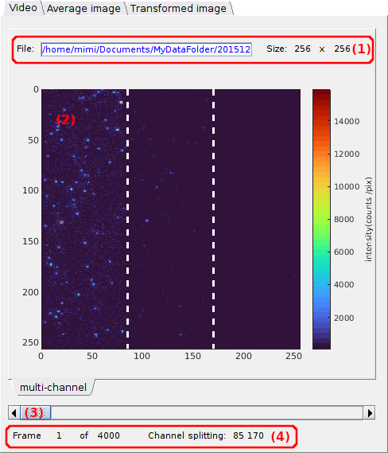
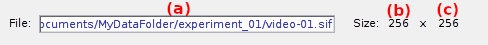
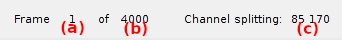
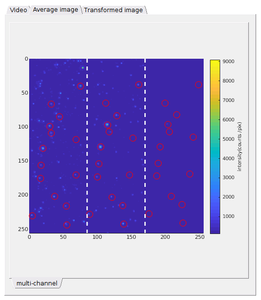
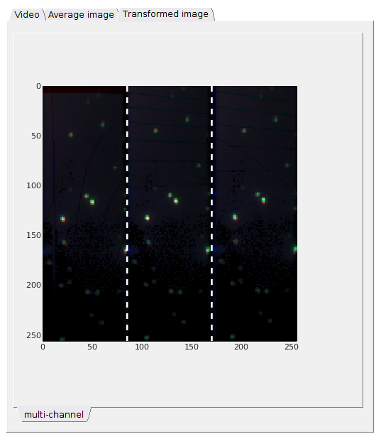

# Visualization area
{: .no_toc }

The visualization area is the main display of module Video processing. 
It consists in three tabs, each showing different video-related data.

Use this area to visualize single molecule video data. 
Any graphics in MASH-FRET can be exported to an image file by right-clicking on the axes and selecting `Export graph`.

## Area components
{: .no_toc .text-delta }

1. TOC
{:toc}

---

## Single molecule video

Use this tab to navigate throught the video frames.

* **(1)** [Video information](#video-information)
* **(2)** [Video visualization](#video-visualization)
* **(3)** [Navigation](#navigation)
* **(4)** [Frame information](#frame-information)
* **(5)** [Create trace tool](#create-trace-tool)
* **(6)** [Zoom tool](#zoom-tool)

### Video information
{: .no_toc }

The video file name and location is shown in **(a)** and video pixel dimensions in **(b)** (width) and **(c)** (height). 

These properties are read-only.

### Video visualization
{: .no_toc }

Shows the current video frame and corresponding spots or molecule positions.

The current video frame is displayed using the units defined in the menu `Units` of the 
[menu bar](../../Getting_started.html#interface). 
Pixel intensities are color-mapped using the 
[Color map](panel-plot.html#color-map) located on the right of the image. 
Dotted white lines are plotted at channel splitting positions given in 
[Video information](#video-information).

To change the current video frame in display, use 
[Navigation](#navigation).

When spots are detected with the tool Spotfinder, reference coordinates are mapped, or when spots coordinates are transformed, the corresponding coordinates are indicated on the display with red circles; see 
[Spotfinder](panel-molecule-coordinates.html#spotfinder) and 
[Coordinates transformation](panel-molecule-coordinates.html#coordinates-transformation) for more information about these two functionalities.

It is possible to zoom in the display and create intensity-time traces at specific positions with a simple click on the display, by using the
[Zoom tool](#zoom-tool) and 
[Create trace tool](#create-trace-tool) respectively.

### Navigation
{: .no_toc }

Use this sliding bar to navigate throught the video frames.

Go to next or previous video frame using the left and right arrows or jump 10% of full video length by clicking on the bar's rail.

When spots are detected with the tool Spotfinder, the corresponding coordinates are shown on each frame with red circles; see 
[Spotfinder](panel-molecule-coordinates.html#spotfinder) for more information.

### Frame information
{: .no_toc }

Shows information about the current frame index and channel splitting positions.

The current frame index is shown in **(a)**, the video length in **(b)** and channel splitting positions (in pixels) in **(c)** considering equal channel widths.

### Create trace tool
{: .no_toc }

Press 
 to activate the "Create trace" cursor.

The "Create trace" cursor allows to generate and plot laser-specific intensity-time traces by simply clicking on a specific pixel in the 
[Video visualization](#video-visualization).

Intensity data can be exported to MATLAB's workspace by pressing 
 in the dialogue box; otherwise press 
.

Intensities are calculated as described in 
[Integration parameters](panel-intensity-integration.html#integration-parameters) and given in units defined in menu `Units` of the 
[Menu bar](../../Getting_started.html#interface).

### Zoom tool
{: .no_toc }

Press 
 to activate the zoom cursor.

The zoom cursor allows to zoom in and out the 
[Video visualization](#video-visualization) like on regular MATLAB axes.

---

## Average image

Use this tab to visualize the average image.

Shows the average image and the corresponding spots or molecule positions.

The average image is calculated using the frame interval defined in 
[Average image](VP-panel-molecule-coordinates.html#average-image). 
Pixel intensities are given in units defined by the menu `Units` of the 
[menu bar](../../Getting_started.html#interface) and are color-mapped using the 
[Color map](panel-plot.html#color-map) located on the right of the image. 
Dotted white lines are plotted at channel splitting positions given in 
[Video information](#video-information).

When spots are detected with the tool Spotfinder, reference coordinates are mapped, or when coordinates are transformed, the corresponding coordinates are indicated on the display with red circles; see 
[Spotfinder](panel-molecule-coordinates.html#spotfinder) and 
[Coordinates transformation](panel-molecule-coordinates.html#coordinates-transformation) for more information about these two functionalities.

It is possible to zoom in the display by using the
[Zoom tool](#zoom-tool).

---

## Transformed image

Use this tab to check the quality of channel transformation.

Shows the superposition of the reference image (in red) and the transformed images (in green and blue for three channels) used in 
[Coordinates transformation](VP-panel-molecule-coordinates.html#coordinates-transformation) to control the quality of the transformation.

Dotted white lines are plotted at channel splitting positions given in 
[Video information](#video-information).

It is possible to zoom in the display by using the
[Zoom tool](#zoom-tool).

