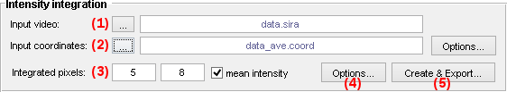
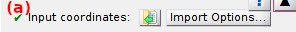
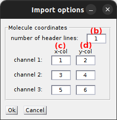

# Intensity integration
{: .no_toc }

Intensity integration is the fifth panel of module Video processing. 
Access the panel content by pressing 
. 
The panel closes automatically after other panels open or after pressing 
. 

Use this panel to create and export single molecule intensity-time traces.

<a class="plain" href="../../assets/images/gui/VP-panel-integration.png"></a>

## Panel components
{: .no_toc .text-delta }

1. TOC
{:toc}


---

## Input video

Use this interface to import the single molecule video used to build intensity-time traces.

<a class="plain" href="../../assets/images/gui/VP-panel-integration-loadvid.png"></a>

Press 
 to import the video from file.
The imported file name is then displayed in **(a)**.

Supported file formats and more information about video import are given in 
[Load video/image file](visualization-area.html#load-videoimage-file).


---

## Input coordinates

Use this interface to import single molecule coordinates used to build intensity-time traces.

<a class="plain" href="../../assets/images/gui/VP-panel-integration-loadcoord.png"></a>

Press 
 to import single molecule coordinates from an ASCII file.
The imported file name is then displayed in **(a)**.

Coordinates are read from the file following user-defined import settings accessed by pressing 
.

<a class="plain" href="../../assets/images/gui/VP-panel-integration-loadcoord-impopt.png"></a>

Single molecule coordinates are coordinates co-localized in each channel, with each channel corresponding to a specific x-range.
The number of file header lines set in **(b)** is skipped before reading coordinates and channel-specific x- and y-coordinates are read from columns set in **(c)** and **(d)** respectively.

If all channel-specific data are organized in the same two columns, coordinates are sorted according to the specific x-range of each channel.

Save import settings by pressing 
.


---

## Integration parameters

Use this interface to define the settings for intensity calculation.

<a class="plain" href="../../assets/images/gui/VP-panel-integration-calculation.png"></a>

To obtain the single molecule intensity at one particular frame or time point, a square area of dimension **(a)** pixels around the molecule coordinates is defined.
The positions of the **(b)** brightest pixels in the corresponding average sub-image are determined and used when summing up the **(b)** pixels in each frame.

Intensities can be plotted as average intensity per pixel by activating the option in **(c)**.
The option affects intensity-time traces created with the 
[Create trace tool](area-visualization.html#create-trace-tool) and exported to the MASH project.
The option is ignored when writing intensity-time traces to ASCII files.


---

## Create and export intensity-time traces

Press 
 to open the export options prior starting intensity-time trace calculations. 

To set export options, please refer to 
[Set export options](../functionalities/set-export-options.html).

After saving export options, intensity calculations start for each 
[Input coordinates](#input-coordinates) and each video frame in the
[Input video](#input-video) with parameters defined in 
[Integration parameters](#integration-parameters).

After completion, single molecule intensity-time traces are exported to files selected in 
[Export options](../functionalities/set-export-options.html) along with:

* a [.mash project file](../../output-files/mash-mash-project.html) that can be used for further processing with MASH-FRET
* a [.tbl file](../../output-files/tbl-intensity-statistics.html) containing statistics on intensity-time traces

This process can be relatively slow if not enough free memory is available on the computer; in this case the video file is browsed every time a pixel value is needed for calculation. 
For more information, please refer to the respective functions in the source code:

```
MASH-FRET/source/mod_video_processing/create_traces/create_trace.m
MASH-FRET/source/mod_video_processing/create_traces/getIntTrace.m
```


