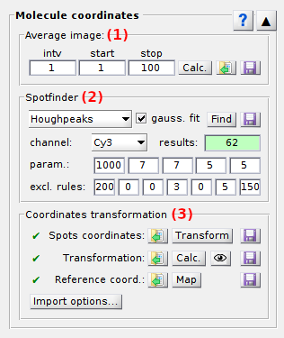
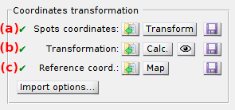

# Molecule coordinates
{: .no_toc }

Molecule coordinates is the third panel of module Video processing. 
Access the panel content by pressing 
. 
The panel closes automatically after other panels open or after pressing 
. 

Use this panel to localize bright spots in the video and obtain single molecule coordinates.

<a class="plain" href="../../assets/images/gui/VP-panel-molcoord.png"></a>

## Panel components
{: .no_toc .text-delta }

1. TOC
{:toc}

---

## Average image

Use this interface to calculate an average image of the video.

<a class="plain" href="../../assets/images/gui/VP-panel-molcoord-aveim.png"></a>

By default, the average image over the full frame range of the video is already calculated and used for 
[Spot detection](#spotfinder). 
If needed, the average image can be calculated over an alternative frame range (*e. g.* the first 100 frames, frames upon a particular laser illumination in an ALEX scheme, etc.) defined by the starting frame index, set in **(a)**, the frame interval, set in **(b)**, and the ending frame index, set in **(c)**.

Press 
 to refresh calculations of the average image.

Press 
 to export the average image to a file. 
Supported file formats are:
* [MASH video format](../../output-files/sira-mash-video.html) (<u>.sira</u>)
* Tagged Image File format (<u>.tif</u>)
* Portable Network Graphics (<u>.png</u>)

To rapidly access the average image folder and import an already-existing average image file, press 
 and select the corresponding file.


---

## Spotfinder

Use this panel to find bright spots in the average image or video and export coordinates.

<a class="plain" href="../../assets/images/gui/VP-panel-molcoord-sf.png"></a>

Spotfinder is limited to the detection of bright spots in video frames and does not include tracking.

To configure the search algorithm, select the detection method in **(a)**.
The four detection methods available are described in the respective sections:
* [in-series screening](#in-series-screening)
* [houghpeaks](#houghpeaks)
* [Schmied2012](#schmied2012)
* [Twotone](#twotone)

As the search algorithm looks for bright spots in individual video channels, method parameters are different for each channel.
To configure the method, select the channel in list **(c)** and set parameters in **(d)**, **(g)** and/or **(h)** according to the method description.

Bright spot intensity profiles can be fitted with 2D-Gaussians to extract shape features by activating the option in **(b)**; see 
[Gaussian fitting](#gaussian-fitting) for more details.

Start spot detection and subsequent Gaussian fitting by pressing 
.

Spots are subsequently sorted according to user-defined criteria, like the number, position, intensity and shape of spots; see 
[Exclusion rules](#exclusion-rules) for more details.
The number of spots found after applying the exclusion rules is displayed in **(p)**.

The final set of spot coordinates is immedialtely made available for 
[Coordinates transformation](#coordinates-transformation) and highlighted in the 
[Video plot](area-visualization.html#video-visualization) and 
[Average image plot](area-visualization.html#average-image) with red circles. 
Spots coordinates can be exported to a 
[.spots file](../../output-files/spots-spots-coordinates) in 
[Coordinates transformation](#coordinates-transformation).


### Gaussian fitting
{: .no_toc }

When Gaussian fitting is activated, a pixel area of **(e)**-by-**(f)** pixels centered on the spot position is fitted with a tilted ellipsoid Gaussian function expressed as:

{: .equation }


with 
[*offset*](){: .math_var } the Gaussian offset, 
[*I*<sub>0</sub>](){: .math_var } the Gaussian amplitude, 
[*x*<sub>0</sub>](){: .math_var } and 
[*y*<sub>0</sub>](){: .math_var } the x- and y- spot coordinates, and with coefficient 
[*a*,](){: .math_var } 
[*b*](){: .math_var } and 
[*c*](){: .math_var } containing information about Gaussian width and orientation:

{: .equation }
<br>
<br>


with 
[*&#963;*<sub>x</sub>](){: .math_var } and 
[*&#963;*<sub>y</sub>](){: .math_var } the Gaussian standard deviations in the x- and y- direction, and 
[*&#952;*](){: .math_var } the Gaussian orientation angle.


### Exclusion rules
{: .no_toc }

Exclusion rules are set in **(i)**-**(o)** and are described in details in the table below.

| field   | description                                                                                                                                                                                                                                               | default |
| :-----: | --------------------------------------------------------------------------------------------------------------------------------------------------------------------------------------------------------------------------------------------------------- | :-----: |
| **(i)** | Maximum number of spots allowed. The brightest spots a preserved.                                                                                                                                                                                         | 200     |
| **(j)** | Minimum spot intensity allowed. Without Gaussian fitting, Intensities are single pixel values. With Gaussian fitting, intensities are the sums of pixel values in the fitting area reduced by the Gaussian offset.                                        | 0 ic    |
| **(k)** | Minimum distance allowed between spots (in pixel).                                                                                                                                                                                                        | 0 px    |
| **(l)** | Minimum distance allowed between spots and image edges (in pixel).                                                                                                                                                                                        | 3 px    |
| **(m)** | *(only with Gaussian fitting)* Minimum Gaussian standard deviation allowed (in pixel).                                                                                                                                                                    | 0 px    |
| **(n)** | *(only with Gaussian fitting)* Maximum Gaussian standard deviation allowed (in pixel).                                                                                                                                                                    | 5 px    |
| **(o)** | *(only with Gaussian fitting)* Maximum Gaussian asymmetry allowed (in percent). The minimum value is 100% for a perfectly spherical Gaussian. An asymmetry of 200% represents a Gaussian twice larger in the x- (or y-) than in the y- (or x-) direction. | 150%    |


### in series-screening
{: .no_toc }

It is a home-made algorithm adapted from 
[houghpeaks](#houghpeaks) but faster. It processes as described below:

1. searches for the brightest pixel in the image considering a minimum pixel intensity set in **(d)**; intensity units are given by the menu `Units` of the 
[Menu bar](../../Getting_started#interface)
1. sets an area of **(g)**-by-**(h)** pixels centered on the brightest pixel to zero
1. repeats steps 1 and 2 until no pixel with intensity higher than **(d)** is found.


### houghpeaks
{: .no_toc }

It is a built-in function of MATLAB and is described in details in 
[MATLAB's documentation](https://fr.mathworks.com/help/images/ref/houghpeaks.html).

The houghpeaks method uses the same principle and parameters as 
[in-serie screening](#in-series-screening) but works slower.


### Schmied2012
{: .no_toc }

It is an algorithm originally designed for super-resolution microscopy and published in the literature<sup>[1](#references)</sup>. 

It identifies bright spots considering:
* a minimum ratio spot intensity over background set in **(d)** 
* a minimum distance to the image edge set in **(h)**.

The Schmied2012 algorithm was written in C and was compiled to .mex file via the `mex` function of MATLAB. 
The .mex file may work with certain MATLAB versions and lead to errors with others. 
If the use of Schmied2012 gives an error, please recompile the .mex file by entering in MATLAB's command window the following:

```matlab
cd 'xxxxx\MASH-FRET\source\extern\schmied2012'
mex 'xxxxx\MASH-FRET\source\extern\schmied2012\forloop.c'
```

with `xxxxx` the path on your computer to the MASH-FRET folder.

If the error persists, please inform us via the 
[issue tracker](https://github.com/RNA-FRETools/MASH-FRET/issues) on Github.


### Twotone
{: .no_toc }

It is an algorithm originally designed to localize single molecules in TIRF-FRET videos and is used in the software Twotone published in the literature<sup>[2](#references)</sup>.

It processes as described below:
1. applies the Twotone image filter to the average image or video frame with a kernel size set in **(d)**; see 
   [Filters](panel-edit-video.html#filters) for more information
1. searches in the filtered image for pixels brighter than the intensity threshold set in **(g)**; intensity units are given by the menu `Units` of the 
[Menu bar](../../Getting_started#interface)
1. selects pixels that are local maxima in the 3-by-3 pixel area around them.


### References
{: .no_toc }

1. J.J. Schmied, A. Gietl, P. Holzmeister, C. Forthmann, C. Steinhauer, T. Dammeyer, P. Tinnefeld, *Fluorescence and super-resolution standards based on DNA origami*, *Nature Methods* **2012**, DOI: [10.1038/nmeth.2254](https://doi.org/10.1038/nmeth.2254).
1. A.N. Kapanidis, N.K. Lee, T.A. Laurence, S. Doose, E.Margeat, S. Weiss, *Defining the Limits of Single-Molecule FRET Resolution in TIRF Microscopy*, *Proc. Nat. Acad. Sci.* **2004**, DOI: [10.1016/j.bpj.2010.09.005](https://doi.org/10.1016/j.bpj.2010.09.005)

---

## Coordinates transformation

Use this panel to transform spots coordinates into other video channels and obtain single molecule coordinates.

<a class="plain" href="../../assets/images/gui/VP-panel-molcoord-transf.png"></a>

Spots coordinates are translated in other channels after applying specific symmetry operations called "spatial transformation".
Coordinates transformation requires both the spots coordinates and the spatial transformation to be available. 
The availability of these data are indicated by the icons located in **(a)** and **(b)**, respectively, that display the symbol <span style="color:rgb(0, 127, 0);">&#10004;</span> if data is available and <span style="color:rgb(255, 0, 0);">&#10006;</span> if data must still be calculated or imported.

In case both data are available, transform spots coordinates by pressing 
. 
Transformed coordinates are immedialtely made available for the creation of intensity-time traces in panel 
[Intensity integration](panel-intensity-integration.html) and highlighted in the 
[Video plot](area-visualization.html#video-visualization) and 
[Average image plot](area-visualization.html#average-image) with red circles. 
They can be exported to a 
[.coord file](../../output-files/coord-transformed-coordinates.html) in panel 
[Intensity integration](panel-intensity-integration.html).

In case spots coordinates are unavailable (<span style="color:rgb(255, 0, 0);">&#10006;</span> in **(a)**):
* Start a spot finding procedure with the [Spotfinder](#spotfinder) tool; spots coordinates can be exported to a 
[.spots file](../../output-files/spots-spots-coordinates.html) by pressing 
 on line **(a)**.
* Or, import spots coordinates from an external file by pressing 
 on line **(a)** and selecting the corresponding file; coordinates are read according to the 
[Import options](#import-options) that can be accessed by pressing 
.

After spot detection or import, spots coordinates are highlighted in the 
[Video plot](area-visualization.html#video-visualization) and 
[Average image plot](area-visualization.html#average-image) with red circles.

In case the spatial transformation is unavailable (<span style="color:rgb(255, 0, 0);">&#10006;</span> in **(b)**):
* Calculate it from a set of reference coordinates by pressing 
; the availability of reference coordinates is indicated by the icon located in **(c)** that displays <span style="color:rgb(0, 127, 0);">&#10004;</span> if data is available and <span style="color:rgb(255, 0, 0);">&#10006;</span> if data must still be imported. 
Transformation can be exported to a 
[.mat file](../../output-files/mat-transformation.html) for future use by pressing 
 on line **(b)**.
* Or, import it from an external 
[.mat file](../../output-files/mat-transformation.html) file by pressing 
 on line **(b)** and selecting the corresponding file.

If reference coordinates are unavailable (<span style="color:rgb(255, 0, 0);">&#10006;</span> in **(c)**): 
* Map coordinates on a reference image where emitters appear in all video channels at once (usually the average image of a fluorescent beads video recorded just before the experiment) with the 
[mapping tool](../functionalities/use-mapping-tool.html) by pressing 
.  
Reference coordinates can be exported to a 
[.map file](../../output-files/map-mapped-coordinates.html) by pressing 
 on line **(c)**
* Or, import them from an external file by pressing 
 on line **(c)** and selecting the corresponding file; coordinates are imported according to the 
[Import options](#import-options) that can be accessed by pressing 
.

After mapping or import, reference coordinates are highlighted in the 
[Video plot](area-visualization.html#video-visualization) and 
[Average image plot](area-visualization.html#average-image) with red circles.

Before transforming any set of coordinates, it is recommended to test the validity of the transformation on a benchmark image (usually the average image of a fluorescent beads video recorded just before the experiment). 
This is done by overlaying the original benchmark image, colored in red, with the transformed ones, colored in green for two channels and in green and blue for three channels. 
Perfect transformation will result in a perfect overlay of images and thus, in a yellow image for two channels, and in a white one for three channels. 
When the original and transformed images are shifted, a new transformation needs to be calculated from a new set of reference coordinates.


Transformation quality can be checked by pressing 
 and selecting the benchmark image file.

***Note:** The calculation of spatial transformations is limited to two and three video channels. This will be extended to an unlimited number of channels in the future.*


### Import options
{: .no_toc }

Press 
 to open the settings to import reference and spots coordinates from ASCII files.

To set the import options, please refer to 
[Set coordinates import options](../functionalities/set-coordinates-import-options.html).

