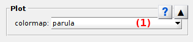

# Plot
{: .no_toc }

Plot is the first panel of module Video processing. 
Access the panel content by pressing 
. 
The panel closes automatically after other panels open or after pressing 
. 

Use this panel to set the appearance and pixel intensity units in the 
[Visualization area](area-visualization.html).

## Panel components
{: .no_toc .text-delta }

1. TOC
{:toc}

---

## Color map

Use this list to define the color palette used to display pixel intensities.

The list contains the standard color maps of MATLAB:

| name     | palette                                                           |
| :------: | :---------------------------------------------------------------: |
| `parula` |  |
| `turbo` |  |
| `hsv` |  |
| `hot` |  |
| `cool` |  |
| `spring` |  |
| `summer` |  |
| `autumn` |  |
| `winter` |  |
| `gray` |  |
| `bone` |  |
| `copper` |  |
| `pink` |  |
| `jet` |  |
| `lines` |  |
| `colorcube` |  |
| `prism` |  |
| `flag` |  |
| `white` |  |

<u>default</u>: `turbo`

