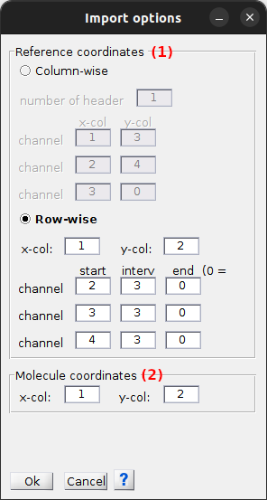

# Set coordinates import options
{: .no_toc }

Import options are the settings used to import spots and reference coordinates from ASCII files. 

They are accessed from panel 
[Coordinates transformation](../panels/panel-molecule-coordinates.html#coordinates-transformation) by pressing 
.

Press 
 to save modifications.

## Window components
{: .no_toc .text-delta }

1. TOC
{:toc}

---

## Reference coordinates

Modify these settings according to the structure of the file containing the reference coordinates.

Reference coordinates are coordinates co-localized in each channel.
Channel-specific coordinates can be written in a column-wise or row-wise fashion to the file.

If emitter coordinates in individual channels are organized
[Column-wise](#column-wise), select **(a)**. 
If emitter coordinates in individual channels are organized
[Row-wise](#row-wise), select **(e)**.

### Column-wise
{: .no_toc }

Coordinates (x,y) of one single molecule in individual channels are written on the same line and in different columns.

A number of header lines to skip in the file can be defined in **(b)**.

For each channel, give the file column indexes where channel-specific x-coordinates, in **(c)**, and y-coordinates, in **(d)**, are written.

### Row-wise
{: .no_toc }

Coordinates (x,y) of one single molecule in individual channels are written on different lines and in the same columns.

This is the default import format and is based on the structure of 
[.map files](../../output-files/map-mapped-coordinates.html).

Give the file column indexes where all x-coordinates, in **(f)**, and y-coordinates, in **(g)**, are written.

For each channel, give respectively in **(h)** and **(j)** the first and last file line where channel-specific coordinates appear, and in **(l)** the file line interval at which channel-specific coordinates are written.

---

## Spots coordinates

Modify these settings according to the structure of the file containing the spots coordinates.

Give in **(a)** and **(b)** the file column indexes where x- and y- coordinates are written.

---

## Reference image dimensions

Update these settings to the dimensions of the reference image used to calculate the transformation file.

They are the dimensions in the x-, set in **(a)**, and y-, set in **(b)**, direction of the reference image used to calculate the transformation.

These dimensions are used to exclude out-of-range spots coordinates prior transformation.

