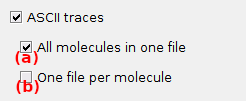

# Set export options
{: .no_toc }

Export options define the particular files to export after completion of time trace calculations in module Video processing.

The window is accessed by pressing 
 in
[Intensity integration](../panels/panel-intensity-integration.html).

Press 
 to start calculating time traces and export files.

## Window components
{: .no_toc .text-delta }

1. TOC
{:toc}

---

## ASCII traces

Export processing parameters and intensity-time traces to one or multiple ASCII files.

Export single molecule data to one common ASCII file, by activating the option in **(a)**, and/or to individual ASCII files, by checking the box in **(b)**.

Exported single molecule data comprise: 
* experiment settings
* parameters and files used for intensity integration 
* single molecule coordinates
* single molecule intensity-time traces

Data can be imported in Trace processing module for further analysis.

See 
[Trace files from video](../../output-files/txt-traces-from-video.html) for more information.

---

## HaMMy-compatible

Export single molecule intensity-time traces to one common ASCII file importable in the external software HaMMy (available 
[here](http://ha.med.jhmi.edu/resources/#1464200861600-0fad9996-bfd4)).

See 
[HaMMy trace files](../../output-files/dat-hammy-traces.html) for more information.

---

## vbFRET-compatible

Export single molecule intensity-time traces to one common MATLAB binary file importable to the external software vbFRET (available 
[here](http://vbfret.sourceforge.net/)).

See 
[vbFRET trace files](../../output-files/mat-vbfret-traces.html) for more information.

---

## QUB-compatible

Export single molecule intensity-time traces to one common ASCII file importable to the external software QUB (available 
[here](https://qub.mandelics.com/)).

See 
[QUB trace files from video](../../output-files/txt-qub-traces.html) for more information.

---

## SMART-compatible

Export single molecule data to one common MATLAB binary file importable to the external software SMART (available 
[here](https://simtk.org/projects/smart)).

Exported single molecule data comprise: 
* single molecule coordinates
* single molecule intensity-time traces

See 
[SMART trace files](../../output-files/traces-smart-traces.html) for more information.

---

## ebFRET-compatible

Export single molecule intensity-time traces to one common ASCII file importable to the external software ebFRET (available 
[here](http://ebfret.github.io/)).

See 
[ebFRET trace files](../../output-files/dat-ebfret-traces.html) for more information.

