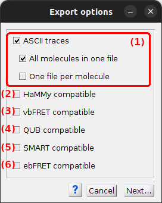

# Set export options
{: .no_toc }

## Window components
{: .no_toc .text-delta }

1. TOC
{:toc}

---

## ASCII traces

---

## HaMMy-compatible

---

## vbFRET-compatible

---

## QUB-compatible

---

## SMART-compatible

---

## ebFRET-compatible

