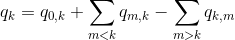
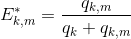
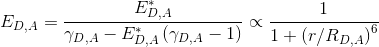
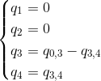
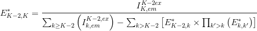
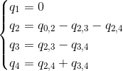
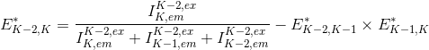
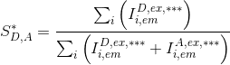

# Set project options
{: .no_toc }

Project options are specific to each project and include emitter-laser relations, FRET and stoichiometry calculations, but also labels and colors used to present data.

They are initially set in module Video processing by pressing 
 in panel 
[Experiment settings](../panels/panel-experiment-settings.html) and can be edited in module Trace processing by pressing 
 in the 
[Project management area](.././trace-processing/panels/area-project-management.html) .

<a href="../../assets/images/gui/VP-panel-expset-opt.png"></a>


## Window components
{: .no_toc .text-delta }

1. TOC
{:toc}

---

## Project parameters

They concern the project title and some optional parameters.

<a href="../../assets/images/gui/VP-panel-expset-opt-projprm.png"></a>

The project title is the name appearing in the project lists. 
It can be modified in **(a)**.
Default titles are named after the
[MASH project file](../../output-files/mash-mash-project.html) or by the directory containing imported ASCII trajectories.

Optional project parameters include the name of the molecule under study, set in **(b)**, and a group of experimental parameters, set in **(c)**.
By default, the group in **(c)** contains parameters:
* `[Mg2+]`: milimolar (`mM`) concentration of Magnesium,
* `[K+] `: milimolar (`mM`) concentration of Potassium,
* `Power(xxxnm)`: power in `mW` of laser with wavelength xxxnm

The user can add personal parameters to the default group.
To do so, the parameter name (here: `buffer n°`) and units (here: empty) must be set in **(e)** and **(f)** respectively, prior pressing 
.
All user-defined parameters are listed in **(d)** and can be removed by pressing 
. 

For the moment, optional parameters solely act as project "tags" saved with the 
[MASH project file](../../output-files/mash-mash-project.html) and exported in
[Processing parameter files](../../output-files/log-processing-parameters.html).


---

## Video channels

They are the channel labels and excitation selectivity.

<a href="../../assets/images/gui/VP-panel-expset-opt-channels.png"></a>

Channel labels are used to easily identify calculated and plotted data. 
Usually, the channel is labelled after the emitter from which photons are collected (ex: `Cy5`).

Emitters are usually excited by one particular laser. 
Knowing the excitation selectivity is necessary for FRET and stoichiometry calculations.

Channel label and excitation wavelength are set by first selecting the channel index in list **(a)** and then selecting the desired label and excitation wavelength in list **(b)** and **(c)** respectively.
Channel indexes correspond to the order of appearance in the video from left to right.

The user can add personal labels to the list **(d)** by writing the new label name in **(e)** and pressing 
. 
Labels can be removed from the list any time by pressing 
.

---

## FRET calculations

They are the possible energy transfer occurring between the detected emitters.

<a href="../../assets/images/gui/VP-panel-expset-opt-fret.png"></a>

To define a donor-acceptor pair in the FRET network, respective labels must be selected in list **(a)** and **(b)** prior pressing 
.
All transfers included in the network are listed in list **(c)** and can be removed any time by pressing 
.

In a FRET network composed of 
[*K*](){: .math_var } emitters and where emitters are indexed according to the red-shift of their emission spectra (1 for the most blue-shifted and K for the most red-shifted), the apparent FRET value 
[*E*\*<sub>*D*,*A*</sub>](){: .math_var } of a pair donor-acceptor with respective indexes 
[*D*](){: .math_var } and 
[*A*](){: .math_var } is calculated as:

{: .equation }
A} \left ( E_{A,k}^{*}  \right ) \right ] \times \sum_{k} \left ( I_{k,em}^{D,ex}  \right )} - \sum_{k>D}^{A-1} \left \{\E_{D,k}^{*} \times \prod_{k'> k}^{A} \left [E_{k,k'}^{*} \times \prod_{k''> k'}^{A} \left (E_{k',k''}^{*}  \right )  \right ]  \right \}">

<!--
{: .equation }
*E*\*<sub>*D*,*A*</sub> = *I*<sub>*A*</sub><sup>*D*</sup> / { [ 1 - &#931;<sub>*A*>*k*&#8805;*K*</sub>( *E*\*<sub>*A*,*k*</sub> ) ] &#215; &#931;<sub>*D*&#8805;*k*&#8805;*K*</sub>( *I*<sub>*k*</sub><sup>*D*</sup> ) }<br><br>
&#160;&#160;&#160;&#160;&#160;&#160;&#160;&#160;&#160;&#160;&#160;&#160;&#160;&#160;&#160;&#160;&#160;&#160;&#160;&#160;&#160;&#160;&#160;&#160;&#160;&#160;
            - &#931;<sub>*D*>*k*>*A*</sub>{ *E*\*<sub>*D*,*k*</sub> &#215; &#928;<sub>*k*>*k'*&#8805;*A*</sub>[ *E*\*<sub>*k*,*k'*</sub> &#215; &#928;<sub>*k'*>*k''*&#8805;*A*</sub>( *E*\*<sub>*k'*,*k''*</sub> ) ] }
-->

with 
[*I*<sub>*k*,em</sub><sup>*k'*,ex</sup>](){: .math_var } the intensity collected in detection channel of emitter 
[*k*](){: .math_var } upon illumination specific to emitter 
[*k'*](){: .math_var }.

As the expression of 
[*E*\*<sub>*D*,*A*</sub>](){: .math_var } depends on other unknown apparent FRET values 
[*E*\*<sub>*A*,*k*</sub>](){: .math_var }, 
[*E*\*<sub>*D*,*k*</sub>](){: .math_var }, 
[*E*\*<sub>*k*,*k'*</sub>](){: .math_var } and 
[*E*\*<sub>*k*',*k''*</sub>](){: .math_var }, the equation is first solved for the most red-shifted donor, *i.e.*, for the pair (
[*D*](){: .math_var } = [*K*](){: .math_var }-1, 
[*A*](){: .math_var } = [*K*](){: .math_var }.

In this case, the expression is simplified to a simple 2-color apparent FRET equation such as:

{: .equation }


<!--
{: .equation }
*E*\*<sub>*K*-1,*K*</sub> = *I*<sub>*K*</sub><sup>*K*-1</sup> / &#931;<sub>*K*-1&#8805;*k*&#8805;*K*</sub>( *I*<sub>*k*</sub><sup>*K*-1</sup> )
-->

giving:

{: .equation }


<!--
{: .equation }
*E*\*<sub>*K*-1,*K*</sub> = *I*<sub>*K*</sub><sup>*K*-1</sup> / ( *I*<sub>*K*</sub><sup>*K*-1</sup> + *I*<sub>*K*-1</sub><sup>*K*-1</sup> )
-->

where 
[*E*\*<sub>*K*-1,*K*</sub>](){: .math_var } depends only on acquired intensity-time traces and thus, can be readily calculated.

Calculated 
[*E*\*<sub>*K*-1,*K*</sub>](){: .math_var } can then be used to solve the equation for the next most red-shifted donor, *i.e.*, for pairs 
([*D*](){: .math_var } = [*K*](){: .math_var }-2, 
[*A*](){: .math_var } = [*K*](){: .math_var }-1, ) and 
([*D*](){: .math_var } = [*K*](){: .math_var }-2, 
[*A*](){: .math_var } = [*K*](){: .math_var }).

In this case, the expression is simplified to a 3-color apparent FRET equation system such as:

{: .equation }
K-1}\left ( E_{K-1,k}^{*} \right ) \right ] \times \sum_{k \geq  K-2}\left ( I_{k,em}^{K-2,ex} \right )  }"><br>
 K-2}\left [ E_{K-2,k}^{*} \times \prod_{k'>k} \left ( E_{k,k'}^{*} \right ) \right ]}">

<!--
{: .equation }
*E*\*<sub>*K*-2,*K*-1</sub> = *I*<sub>*K*-1</sub><sup>*K*-2</sup> / { [ 1 - &#931;<sub>*K*-1>*k*&#8805;*K*</sub>( *E*\*<sub>*K*-1,*k*</sub> ) ] &#215; &#931;<sub>*K*-2&#8805;*k*&#8805;*K*</sub>( *I*<sub>*k*</sub><sup>*K*-2</sup> ) }<br><br>
*E*\*<sub>*K*-2,*K*</sub> = *I*<sub>*K*</sub><sup>*K*-2</sup> / &#931;<sub>*K*-2&#8805;*k*&#8805;*K*</sub>( *I*<sub>*k*</sub><sup>*K*-2</sup> ) - &#931;<sub>*K*-2>*k*>*K*</sub>[ *E*\*<sub>*K*-2,*k*</sub> &#215; &#928;<sub>*k*>*k'*&#8805;*K*</sub>( *E*\*<sub>*k*,*k'*</sub> ) ]
-->

giving:

{: .equation }
<br>


<!--
{: .equation }
*E*\*<sub>*K*-2,*K*-1</sub> = *I*<sub>*K*-1</sub><sup>*K*-2</sup> / ( 1 - *E*<sub>*K*-1,*K*</sub> ) &#215; ( *I*<sub>*K*</sub><sup>*K*-2</sup> + *I*<sub>*K*-1</sub><sup>*K*-2</sup> + *I*<sub>*K*-2</sub><sup>*K*-2</sup> )<br><br>
*E*\*<sub>*K*-2,*K*</sub> = *I*<sub>*K*</sub><sup>*K*-2</sup> / ( *I*<sub>*K*</sub><sup>*K*-2</sup> + *I*<sub>*K*-1</sub><sup>*K*-2</sup> + *I*<sub>*K*-2</sub><sup>*K*-2</sup> ) - *E*<sub>*K*-2,*K*-1</sub> &#215; *E*<sub>*K*-1,*K*</sub> 
-->

where 
[*E*\*<sub>*K*-2,*K*-1</sub>](){: .math_var } depends on acquired intensity-time traces and the previously calculated 
[*E*\*<sub>*K*-1,*K*</sub>](){: .math_var }.

Calculated 
[*E*\*<sub>*K*-2,*K*-1</sub>](){: .math_var } and 
[*E*\*<sub>*K*-2,*K*</sub>](){: .math_var } can then be used to solve the equation for the next most red-shifted donor and so on ...

To know more about how multi-color apparent FRET data are calculated, please refer to the respective functions in the source code:

```
MASH-FRET/buildFretexpr.m
MASH-FRET/source/traces/processing/FRET/calcFRET.m
```

---

## Stoichiometry calculations

They are the desired emitter stoichiometries to be calculated and plotted.

<a href="../../assets/images/gui/VP-panel-expset-opt-s.png"></a>

The stoichiometry of an emitter is usually used to estimate the ratio of different emitters on the single molecule under observation.

The stoichiometry 
[*S*<sub>*D*</sub>](){: .math_var } of an emitter 
[*D*](){: .math_var } specifically detected in channel 
[*D*<sub>em</sub>](){: .math_var } and specifically excited by illumination 
[*D*<sub>ex</sub>](){: .math_var } in a labelling scheme consisting of 
[*K*](){: .math_var } emitters, is calculated as:

{: .equation }


<!--
{: .equation }
*S*<sub>*D*</sub> = &#931;<sub>1&#8805;*k*&#8805;*K*</sub>( *I*<sub>*k*,em</sub><sup>*D*,ex</sup> ) / &#931;<sub>1&#8805;*k*&#8805;*K*</sub>[ &#931;<sub>1&#8805;*k'*&#8805;*K*</sub>( *I*<sub>*k*,em</sub><sup>*k'*,ex</sup> ) ]
-->

with 
[*I*<sub>*k*,em</sub><sup>*k'*,ex</sup>](){: .math_var } the intensity collected from emitter 
[*k*](){: .math_var } specifically detected in channel 
[*k*<sub>em</sub>](){: .math_var } and upon illumination 
[*k'*<sub>ex</sub>](){: .math_var }, that specifically excites emitter 
[*k'*](){: .math_var }.

A stoichiometry 
[*S*<sub>*D*</sub>](){: .math_var } = 0.5 means that 50% of the total number of collected photons belongs to the emitter 
[*D*](){: .math_var }.

To activate the calculation of an emitter stoichiometry, the corresponding channel label must be selected in **(a)** prior pressing 
.
All desired stoichiometry calculations are listed in **(b)** and can be removed any time by pressing 
.

---

## Color code

They are the colors used to identify calculated and plotted traces

<a href="../../assets/images/gui/VP-panel-expset-opt-colors.png"></a>

To set the RGB color of a specific trace, select the data in list **(a)** and set the red, green and blue values in **(b)**, **(c)** and **(d)** respectively.
Red, green and blue takes values between 0 and 1.

The resulting color is displayed in **(e)** and can be exported to list **(a)** by pressing 
.

