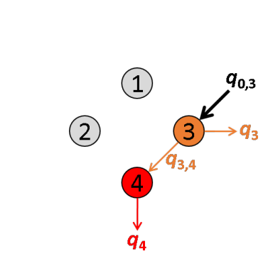
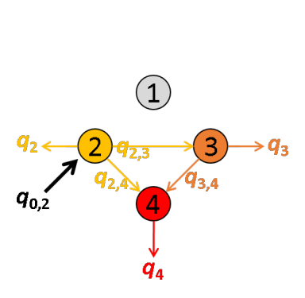
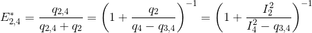
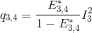
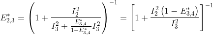
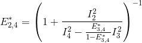
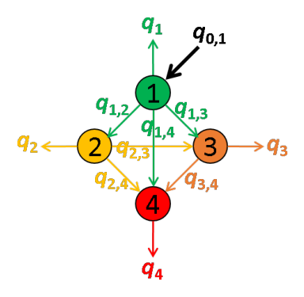
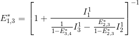
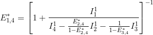
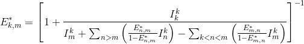

# Set project options
{: .no_toc }

Project options are specific to each project and include emitter-laser relations, FRET and stoichiometry calculations, but also labels and colors used to present data.

They are initially set in module Video processing by pressing 
 in panel 
[Experiment settings](../panels/panel-experiment-settings.html) and can be edited in module Trace processing by pressing 
 in the 
[Project management area](.././trace-processing/panels/area-project-management.html) .

Press 
 to save and apply immediately the modifications to the project.

<a class="plain" href="../../assets/images/gui/VP-panel-expset-opt.png"></a>


## Window components
{: .no_toc .text-delta }

1. TOC
{:toc}

---

## Project parameters

Use this panel to define the project title and some optional parameters.

<a class="plain" href="../../assets/images/gui/VP-panel-expset-opt-projprm.png"></a>

The project title is the name appearing in the project lists. 
It can be defined in **(a)** or default title can be used by leaving **(a)** empty.
By default, projects are titled after the corresponding 
[.mash file](../../output-files/mash-mash-project.html) or after the source directory when traces are imported from ASCII files.

Optional project parameters include the name of the molecule under study, set in **(b)**, and a group of experimental parameters, set in **(c)**.
By default, the group in **(c)** contains parameters:
* `[Mg2+]`: milimolar (`mM`) concentration of Magnesium,
* `[K+] `: milimolar (`mM`) concentration of Potassium,
* `Power(xxxnm)`: power in `mW` of laser with wavelength xxxnm

The user can add personal parameters to the default group.
To do so, the parameter name (here: `buffer n°`) and units (here: empty) must be set in **(e)** and **(f)** respectively, prior pressing 
.
All user-defined parameters are listed in **(d)** and can be removed by pressing 
. 

For the moment, optional parameters solely act as project "tags" saved with the 
[MASH project file](../../output-files/mash-mash-project.html) and exported in
[Processing parameter files](../../output-files/log-processing-parameters.html).


---

## Video channels

Use this panel to define the channel labels and excitation selectivity.

<a class="plain" href="../../assets/images/gui/VP-panel-expset-opt-channels.png"></a>

Channel labels are used to easily identify calculated and plotted data. 
Usually, the channel is labelled after the emitter from which photons are collected (ex: `Cy5`).

Emitters are usually excited by one particular laser. 
Knowing the excitation selectivity is necessary for FRET and stoichiometry calculations.

Channel label and excitation wavelength are set by first selecting the channel index in list **(a)** and then selecting the desired label and excitation wavelength in list **(b)** and **(c)** respectively.
Channel indexes correspond to the order of appearance in the video from left to right.

The user can add personal labels to the list **(d)** by writing the new label name in **(e)** and pressing 
. 
Labels can be removed from the list any time by pressing 
.

---

## FRET calculations

Use this panel to define the FRET pairs.

<a class="plain" href="../../assets/images/gui/VP-panel-expset-opt-fret.png"></a>

To define a donor-acceptor pair in the multiple FRET-pair network, labels must be selected in list **(a)** and **(b)** respectively prior pressing 
.
All FRET pairs included in the network are listed in **(c)** and can be removed any time by pressing 
.

In a FRET-pair network composed of several emitters, quantities of energy absorbed by each of the emitters can be emitted as light or transferred via FRET to other emitters providing a non-negligible overlap of the donor emission spectrum with the absorption spectra of the acceptors. 

These energy movements can be represented on a scheme where:
- emitters are numbered according to the red shift of the absorption spectrum
- the energy quantity absorbed by emitter 
[*k*](){: .math_var } exclusively is noted 
[*q*<sub>0,*k*</sub>](){: .math_var }, 
- the quantity of energy emitted by emitter 
[k](){: .math_var } is noted 
[*q*<sub>*k*</sub>](){: .math_var },
- the energy quantity transferred by FRET from emitter 
[*k*](){: .math_var } to emitter 
[*m*](){: .math_var } is noted 
[*q*<sub>*k*,*m*</sub>](){: .math_var }.

For example, the energy movements in a FRET-pair network composed of four emitters with different absorption and emission properties are summarized in the following scheme.

<a class="plain" href="../../assets/images/figures/VP-FRET-calculations-4-color-scheme.png"></a>

In an ideal system that includes radiative processes and energy transfers only, the law of conservation of energy supposed that:

{: .equation }
k}q_{k,m}"/>

The energy quantity 
[*q*<sub>*k*</sub>](){: .math_var} is comparable to the intensity detected in emission channel of emitter 
[*k*](){: .math_var} and corrected from background and cross-talks. 
Thus, 
[*q*<sub>*k*</sub>](){: .math_var} values are measured during the experiment.

The apparent efficiency 
[*E*\*<sub>*k*,*m*</sub>](){: .math_var} of an energy transfer from a donor 
[*k*](){: .math_var} to an acceptor 
[*m*](){: .math_var} is calculated as:

{: .equation }


To obtain the probability of energy transfer 
[*E*<sub>*k*,*m*</sub>](){: .math_var}, which is inversely proportional to the distance 
[*r*](){: .math_var} between the two dyes, 
[*E*\*<sub>*k*,*m*</sub>](){: .math_var} must later be corrected by considering (1) the different quantities of non-radiative energy lost during the process by both emitters 
[*k*](){: .math_var} and 
[*m*](){: .math_var} as well as (2) the different detection efficiencies of photons emitted by emitters
[*k*](){: .math_var} and 
[*m*](){: .math_var}; see 
[Correct FRET values](../../trace-processing/workflow.html#correct-fret-values) for more information.

The energy quantity 
[*q*<sub>*k*,*m*</sub>](){: .math_var} is calculated from intensities measured upon different laser illuminations, <u>starting with specific excitation of the most red-shifted donor</u>. 
For the limiting case where the most red-shifted donor transfers energy to multiple acceptors, FRET efficiencies can not be analytically calculated.

Translated in a four-emitter network, the most red-shifted donor is the emitter 3, which can transfer energy to emitter 4 only. 
This comes down to a simple two-emitter network where energy movements can be depicted as in the following scheme.

<a class="plain" href="../../assets/images/figures/VP-FRET-calculations-4-color-scheme-exc3.png"></a>

Using the law of conservation of energy and the definition of the apparent FRET efficiency of the donor-acceptor pair 3- 4, we can readily calculate 
[*E*\*<sub>3,4</sub>](){: .math_var} from measured intensities such as:

{: .equation }


The next most red-shifted donor is the emitter 2, which can transfer energy to emitters 3 and 4. 
This comes down to a three-emitter network where energy movements can be depicted as in the following scheme.
 
<a class="plain" href="../../assets/images/figures/VP-FRET-calculations-4-color-scheme-exc2.png"></a>

Using the law of conservation of energy and the definition of the apparent FRET efficiencies of the donor-acceptor pairs 2- 3 and 2-4, we can express
[*E*\*<sub>2,3</sub>](){: .math_var} and
[*E*\*<sub>2,4</sub>](){: .math_var} in function of measured intensities and the quantity 
[*q*<sub>3,4</sub>](){: .math_var} such as:

{: .equation }
<br>


According to the definition of the apparent FRET efficiency, 
[*q*<sub>3,4</sub>](){: .math_var} can be expressed in function of measured intensities and the known 
[*E*\*<sub>3,4</sub>](){: .math_var}, such as:



Put together, these equations allow to calculate 
[*E*\*<sub>2,3</sub>](){: .math_var} and
[*E*\*<sub>2,4</sub>](){: .math_var} in function of measured intensities and the known 
[*E*\*<sub>3,4</sub>](){: .math_var}, such as:

<br>


The next most red-shifted donor is the emitter 1, which can transfer energy to emitters 1, 3 and 4. 
Energy movements can be depicted as in the following scheme:
 
<a class="plain" href="../../assets/images/figures/VP-FRET-calculations-4-color-scheme-exc1.png"></a>

FRET efficiencies for the FRET pairs 1-2, 1-3 and 1-4 are determined using the same deductive path as presented above, giving:

{: .equation }
<br>
<br>


This demonstration can be generalized to a 
[*K*](){: .math_var }-emitter network with the apparent FRET efficiency 
[*E*\*<sub>k,m</sub>](){: .math_var} – of a donor-acceptor pair 
[*k*](){: .math_var }-[*m*](){: .math_var } with 
[*m*](){: .math_var }>[*k*](){: .math_var } – being calculated from intensities detected upon excitation of emitter 
[*k*](){: .math_var } and apparent FRET efficiencies obtained from more red-shifted FRET-pairs, such as:

m}\left (\frac{E_{n,m}^*}{1-E_{n,m}^*}I_n^k\right )-\sum_{k<n<m}\left(\frac{E_{m,n}^*}{1-E_{m,n}^*}I_{m}^k\right )}\right ]^{-1}"/>

To know more about how multi-color apparent FRET data are calculated, please refer to the respective functions in the source code:

```
MASH-FRET/tools/buildFretexpr.m
MASH-FRET/source/mod-trace-processing/FRET/calcFRET.m
```

---

## Stoichiometry calculations

Use this panel to define the emitter stoichiometries to be calculated and plotted.

<a class="plain" href="../../assets/images/gui/VP-panel-expset-opt-s.png"></a>

The stoichiometry of an emitter is usually used to estimate the ratio of different emitters on the single molecule under observation.

The stoichiometry 
[*S*<sub>*D*</sub>](){: .math_var } of an emitter 
[*D*](){: .math_var } specifically detected in channel 
[*D*<sub>em</sub>](){: .math_var } and specifically excited by illumination 
[*D*<sub>ex</sub>](){: .math_var } in a labelling scheme consisting of 
[*K*](){: .math_var } emitters, is calculated as:

{: .equation }


with 
[*I*<sub>*k*,em</sub><sup>*k'*,ex</sup>](){: .math_var } the intensity collected from emitter 
[*k*](){: .math_var } specifically detected in channel 
[*k*<sub>em</sub>](){: .math_var } and upon illumination 
[*k'*<sub>ex</sub>](){: .math_var }, that specifically excites emitter 
[*k'*](){: .math_var }.

A stoichiometry 
[*S*<sub>*D*</sub>](){: .math_var } = 0.5 means that 50% of the total number of collected photons belongs to the emitter 
[*D*](){: .math_var }.

To activate the stoichiometry calculation for an emitter in particular, the emitter's label must be selected in **(a)** prior pressing 
.
All desired stoichiometry calculations are listed in **(b)** and can be removed any time by pressing 
.

---

## Color code

Use this panel to define the colors used to plot and identify the time traces.

<a class="plain" href="../../assets/images/gui/VP-panel-expset-opt-colors.png"></a>

To set the RGB color of a specific trace, select the data in list **(a)** and press
 to open the color picker.

