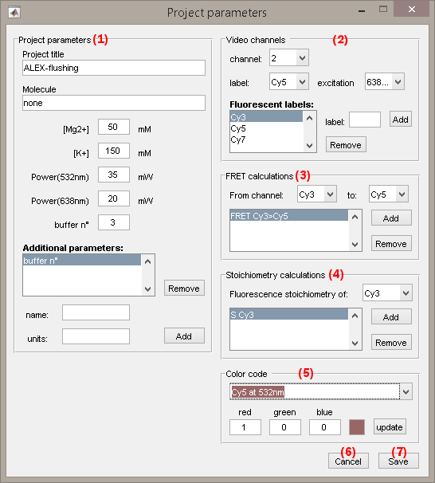
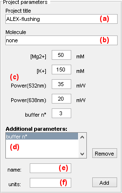
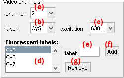
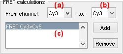
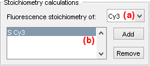
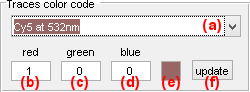

# Set project options
{: .no_toc }

Project options are specific to each project and include emitter-laser relations, FRET and stoichiometry calculations, but also labels and colors used to present data.

They are initially set in module Video processing (see 
[Project options](../panels/panel-experiment-settings.html#project-options) for more information) and can be edited in module Trace processing (see 
[Edit project options](../../trace-processing/panels/area-management.html#edit-project-options) for more information).

<a href="../../assets/images/gui/VP-panel-expset-opt.png"></a>


## Window components
{: .no_toc .text-delta }

1. TOC
{:toc}

---

## Project parameters

They concern the project title and some optional parameters.

<a href="../../assets/images/gui/VP-panel-expset-opt-projprm.png"></a>

The project title is the name appearing in the project lists. 
It can be modified in **(a)**.
Default titles are named after the
[MASH project file](../../output-files/mash-mash-project.html) or by the directory containing imported ASCII trajectories.

Optional project parameters include the name of the molecule under study, set in **(b)**, and a group of experimental parameters, set in **(c)**.
By default, the group in **(c)** contains parameters:
* `[Mg2+]`: milimolar (`mM`) concentration of Magnesium,
* `[K+] `: milimolar (`mM`) concentration of Potassium,
* `Power(xxxnm)`: power in `mW` of laser with wavelength xxxnm

The user can add personal parameters to the default group.
To do so, the parameter name (here: `buffer n°`) and units (here: empty) must be set in **(e)** and **(f)** respectively, prior pressing **Add**.
All user-defined parameters are listed in **(d)** and can be removed by pressing **Remove**. 

For the moment, optional parameters solely act as project "tags" saved with the 
[MASH project file](../../output-files/mash-mash-project.html) and exported in
[Processing parameter files](../../output-files/log-processing-parameters.html).


---

## Video channels

They are the channel labels and excitation selectivity.

<a href="../../assets/images/gui/VP-panel-expset-opt-channels.png"></a>

Channel labels are used to easily identify calculated and plotted data. 
Usually, the channel is labelled after the emitter from which photons are collected (ex: `Cy5`).

Emitters are usually excited by one particular laser. 
Knowing the excitation selectivity is necessary for FRET and stoichiometry calculations.

Channel label and excitation wavelength are set by first selecting the channel index in list **(a)** and then selecting the desired label and excitation wavelength in list **(b)** and **(c)** respectively.
Channel indexes correspond to the order of appearance in the video from left to right.

The user can add personal labels to the list **(b)** by writing the new label name in **(e)** and pressing **Add**. 
Labels can be removed from the list any time by pressing **Remove**.

---

## FRET calculations

They are the possible energy transfer occurring between the detected emitters.

<a href="../../assets/images/gui/VP-panel-expset-opt-fret.png"></a>

To define an energy transfer, the donor and acceptor labels must be selected in the respective list **(a)** and **(b)** prior pressing **Add**.
All transfers are listed in list **(c)** and can be removed any time by pressing **Remove**.

To know more about how multi-color FRET data are calculated, please refer to the respective function in the source code:

```
MASH-FRET/source/traces/processing/FRET/calcFRET.m
```

---

## Stoichiometry calculations

They are the desired emitter stoichiometries to be calculated and plotted.

<a href="../../assets/images/gui/VP-panel-expset-opt-s.png"></a>

The stoichiometry of an emitter is usually used to estimate the ratio of different emitters on the single molecule under observation.

The stoichiometry *S<sub>i</sub>* of an emitter detected in channel *i* is calculated as:

{: .bg-grey-lt-000 .pt-3 .pb-3 .pl-3 .pr-3 .fs-3}
<p style="border-radius: 5px;">
<i>S<sub>i</sub></i> = <i>I</i><sub>tot,em</sub><sup><i>i</i>,ex</sup> / <i>I</i><sub>tot,em</sub><sup>tot,ex</sup>
</p>

with:
* *I*<sub>tot,em</sub><sup><i>i</i>,ex</sup> the intensity collected upon selective excitation of emitter *i* and summed over all detected channels
* *I*<sub>tot,em</sub><sup>tot,ex</sup> the intensity collected upon all excitations and summed over all detected channels

A stoichiometry *S<sub>i</sub>* = 0.5 means that 50% of the total number of collected photons belongs to emitter *i*.

To activate the calculation of an emitter stoichiometry, the corresponding channel label must be selected in **(a)** prior pressing **Add**.
All desired stoichiometry calculations are listed in **(b)** and can be removed any time by pressing **Remove**.

---

## Color code

They are the colors used to identify calculated and plotted traces

<a href="../../assets/images/gui/VP-panel-expset-opt-colors.png"></a>

To set the RGB color of a specific trace, select the data in list **(a)** and set the red, green and blue values in **(b)**, **(c)** and **(d)** respectively.
Red, green and blue takes values between 0 and 1.

The resulting color is displayed in **(e)** and can be exported to list **(a)** by pressing **update**.

