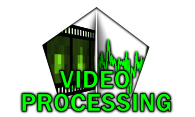
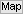
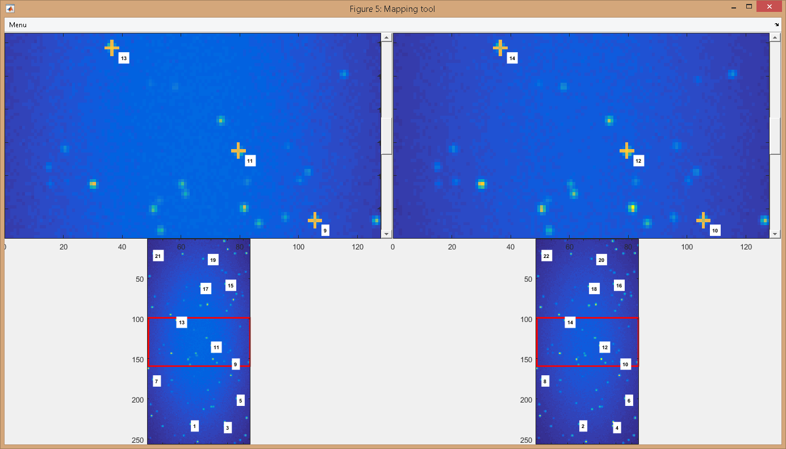
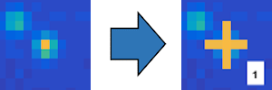
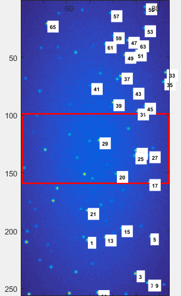
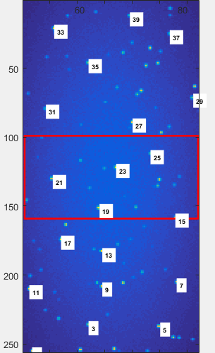
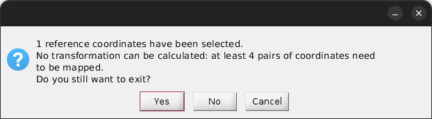
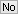

# Use the mapping tool
{: .no_toc }

The mapping tool allows to manually localize the position of single emitters in each video channel

The tool is accessed by pressing 
 in the 
[Coordinates transformation](../components/panel-molecule-coordinates#coordinates-transformation) panel of module Video processing.

It is used to map the reference coordinates that are needed to calculate the spatial transformation. 
The mapping tool is an adaptation of the 
[Control Point Selection tool](https://www.mathworks.com/help/images/ref/cpselect.html) of MATLAB for images containing more than two channels.

To map and export the reference coordinates, follow the procedure described below.

## Procedure
{: .no_toc .text-delta }

1. TOC
{:toc}

---

## Import and visualize the reference image

### Reference image
{: .no_toc }

A reference image must show luminescent objects visible in all channels. 
Usually, the average image of a video showing fluorescent beads is used; see 
[Average image](../components/panel-molecule-coordinates.html#average-image) for more information about exporting an average image. 

The reference image file is requested after pressing 
 and prior opening the mapping tool.
Supported file formats are:
* Portable Network Graphics (<u>.png</u>)
* Tagged Image File format (<u>.tif</u>)

After importing the image, the Mapping tool opens.

### Display
{: .no_toc }

The image display is divided horizontally according to the number of video channels defined in 
[Channels](../../tutorials/set-experiment-settings/import-video.html#channels).

Full-length images of each channel are shown on the bottom and close-ups of the respective images are shown on the top.
Parts of the images shown in close-ups are indicated by a red rectangle on the full-length images.

Zoom magnification within the field of view can be increased/decreased using the top sliding bar "Zoom".

The close-up field of view is indicated by a rectangle in the full-length image.
Shift the position of the field of view using the horizontal and vertical sliding bars located on the top and right-hand side of the close-ups.

Any graphics in MASH can be exported to an image file by right-clicking on the axes and selecting `Export graph`.

---

## Localize single emitters

If a single emitter is visible in all video channel, localize it in the close-up of the left-most channel by simply clicking on the brightest pixel. 
The emitter is correctly localized only if a colored cross appears at the selected position along with a numbered label.

Numbered labels give the localization order of all positions and are shown on the full-length images.

If the position was mistargeted, go to `Menu` in the menu bar and select `Delete last point`.
This will cancel the last selection.

Repeat the localization of the same emitter in all other channels to complete the mapping of this emitter.
You can cancel the localization of the last emitter in all channels by going to `Menu` in the menu bar and selecting `Delete last set`.

Map a consequent number of emitters (more than 4) in the reference image using the sliding bars to move through the image. 
The goal is to cover the whole image area in an homogeneous fashion in order to give an accurate representation of the space in each channel.

| inhomogeneous mapping                                                                                  | homogeneous mapping                                                                                  |
| :----------------------------------------------------------------------------------------------------: | :--------------------------------------------------------------------------------------------------: |
| the mapping over-represents the right-hand side of the image                                           | the mapping is sufficient and relatively homogeneous                                                 |
|  |  |

---

## Export mapped coordinates

To save the set of mapped coordinates and make it available for the calculation of the spatial transformation in panel 
[Coordinates transformation](../components/VP-panel-molcoord.html#coordinates-transformation), simply close the mapping tool or go to `Menu` in the menu bar and select `Close and save`.

If the number of emitters mapped in the reference image is insufficient, a dialogue box will pop up to warn you.

Press 
 to continue mapping and extend the number of emitters, or press 
 to save the current set of mapped coordinates.

After saving, coordinates are immediately available in panel
[Coordinates transformation](../components/panel-molecule-coordinates.html#coordinates-transformation) to calculate the spatial transformation.

Mapped coordinates can be exported to a 
[.map file](../../output-files/map-mapped-coordinates.html) by going to `Menu > Export to file...` in the menu bar.

