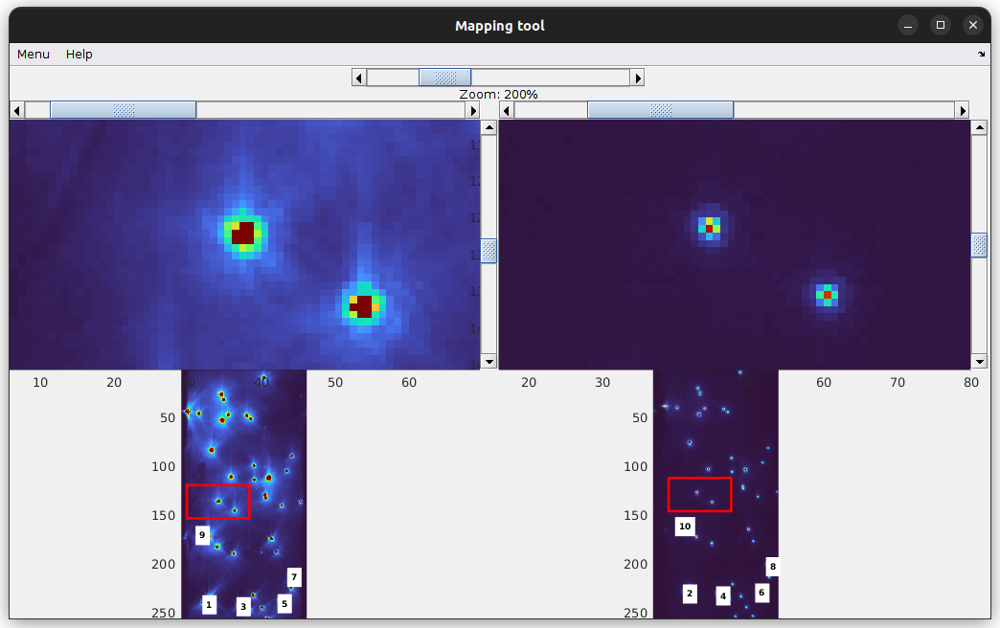

# Use the mapping tool
{: .no_toc }

## Window components
{: .no_toc .text-delta }

1. TOC
{:toc}

---

A reference image displays luminescent objects visible in all channels. It is usually the average image of a single beads video; see 
[Average image](../panels/panel-molecule-coordinates.html#average-image) for more information about exporting an average image. 

