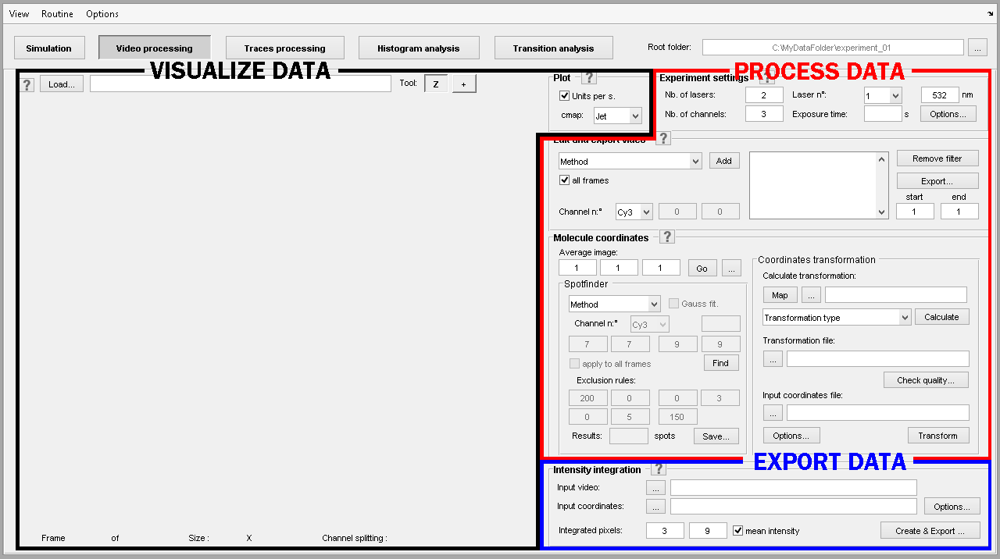

# Video processing interface
{: .no_toc }

The module Video processing is the second component of the software MASH-FRET and can be selected in the main 
[tool bar](../Getting_started.html#interface).

The interface can be divided into three subunits that respectively allow to:
* <u>visualize</u> imported video data
* <u>process</u> the imported data
* <u>export</u> the calculated intensity data

Learn about individual components of the interface in the 
[Panels](panels.html) section.

