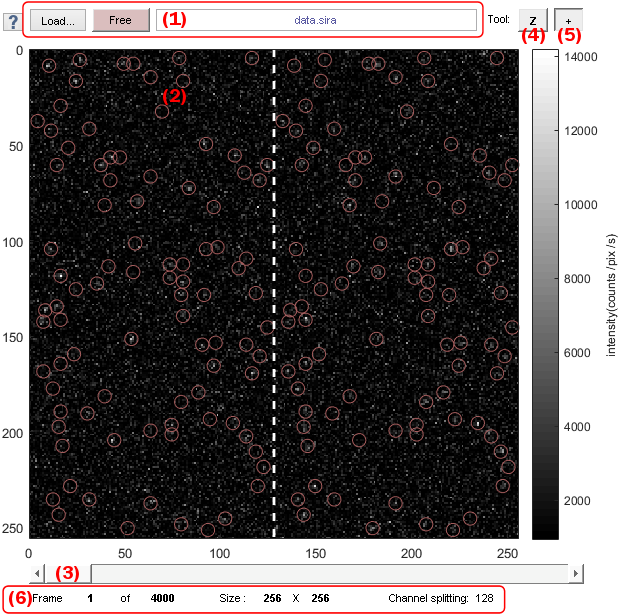
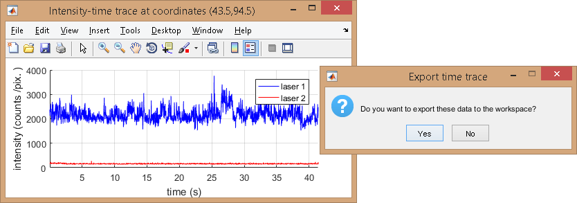

# Visualization area
{: .no_toc }

<a href="../../assets/images/gui/VP-area-visu.png"></a>

## Panel components
{: .no_toc .text-delta }

1. TOC
{:toc}

---

## Load video/image file

It manages the import of videos or images to MASH.

Supported file formats are:
* Source Input Format (<u>.sif</u>)
* [WinSpec CCD Capture format](http://www.mpi.stonybrook.edu/nsls/X17B2/support/camera.htm) (<u>.spe</u>)
* [Single data acquisition format](https://cplc.illinois.edu/software/) (<u>.pma</u>)
* Audio Video Interleave (<u>.avi</u>)
* Tagged Image File format (<u>.tif</u>)
* Graphics Interchange Format (<u>.gif</u>)
* [MASH video format](../../output-files/sira-mash-video.html) (<u>.sira</u>)
* Portable Network Graphics (<u>.png</u>)

To load a video or an image, press **Load** and select the corresponding file in the browser.
After completion, the imported file name is written in **(1)**, 
[Video information](#video-information) and
[Exposure time](panel-experiment-settings.html#exposure-time) are automatically updated in the GUI and the first video frame is displayed.

To programmatically add new video formats, update the following functions in the source code:

```
MASH-FRET\source\graphic_files\loadMovFile.m
MASH-FRET\source\graphic_files\getFrames.m
MASH-FRET\source\graphic_files\exportMovie.m
```

---

## Video visualization

The current video frame is displayed with colors defined in the 
[Color map](panel-plot.html#color-map).
Pixel intensities are given by the color bar located on the right of the image with intensity units defined by 
[Intensity units](panel-plot.html#intensity-units). 
To change the current video frame in display, use 
[Navigation](#navigation).

Dotted white lines are plotted at channel splitting positions indicated in 
[Video information](#video-information).

When bright spots are detected with the tool Spotfinder or when coordinates are transformed, corresponding coordinates are located on the display with red circles; see 
[Spotfinder](panel-molecule-coordinates.html#spotfinder) and 
[Coordinates transformation](panel-molecule-coordinates.html#coordinates-transformation) for more information.

It is possible to zoom in the display and create intensity-time traces at specific positions by clicking on the display; see 
[Zoom tool](#zoom-tool) and 
[Create trace tool](#create-trace-tool) for more details.

---

## Navigation

Changes the current frame in display.

Go to next or previous video frame using the left and right arrows or jump to 10% of full video length by clicking on the sliding bar.

---

## Zoom tool

Activates zoom cursor.

When selected, the zoom tool allows to zoom in and out on the display.

---

## Create trace tool

Activates create trace cursor.

When selected, the create trace tool calculates and plots laser-specific intensity-time traces at one pixel position by simply clicking on the display.
Intensity data can be exported to MATLAB's workspace by pressing **Yes** in the dialogue window.

<a href="../../assets/images/gui/VP-area-visu-traces.png"></a>

Intensities are calculated as described in 
[Integration parameters](panel-intensity-integration.html#integration-parameters).

---

## Video information

It includes information about the current frame index, video dimensions and channel split.

<a href="../../assets/images/gui/VP-area-visu-info.png"></a>

The current frame index is shown in **(a)**, the video length in **(b)**, video dimensions (pixels) in x- and y-directions in **(c)** and channel splitting positions (pixels) in **(d)** considering equal channel widths.

Channels split positions are automatically updated whenever the number of channel is changed; see 
[Number of video channels](panel-experiment-settings.html#number-of-video-channels) for more information.
