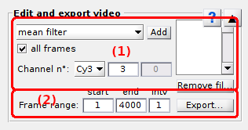

# Edit video
{: .no_toc }

## Panel components
{: .no_toc .text-delta }

1. TOC
{:toc}

---

## Filter settings

Use these settings to configure an image filter to apply to the loaded video or image.

Image filters treat each video channels separately. 
To configure a filter, select the first channel in list **(c)** and the image filter in list **(a)**. 
Each filter uses zero to two user-defined parameters that can be set in **(c)** and **(d)** and that are detailed in the table below.

| filter                                                                         | description                                                                                                                                                                                                                                                                                                                                                                                                                                                                                                                                                        | default *p*1 | default *p*2 |
| ------------------------------------------------------------------------------ | ------------------------------------------------------------------------------------------------------------------------------------------------------------------------------------------------------------------------------------------------------------------------------------------------------------------------------------------------------------------------------------------------------------------------------------------------------------------------------------------------------------------------------------------------------------------ | --------------- | --------------- |
| `Gaussian filter`                                                              | Pixels are convolved with a Gaussian function with ***p*1** the size of the kernel and ***p*2** the Gaussian standard deviation.                                                                                                                                                                                                                                                                                                                                                                                                             |  |  |
| `mean filter`                                                                  | Pixels are convolved with a rectangle function with ***p*1** the size of the kernel.                                                                                                                                                                                                                                                                                                                                                                                                                                                                    |  |  |
| `median filter`                                                                | Pixels are replaced by the median value of the ***p*1** neighbouring pixels.                                                                                                                                                                                                                                                                                                                                                                                                                                                                            |  |  |
| `Crocker-Grier filter`[ref](https://doi.org/10.1006/jcis.1996.0217) | Mean-filtered pixels are subtracted to Gaussian filtered-pixels, using ***p*1** as the kernel size and ***p*2** as the Gaussian standard deviation                                                                                                                                                                                                                                                                                                                                                                                           |  |  |
| `local Wiener filter`                                                          | The estimated noise intensity per pixel ***p*2** is subtracted to the ***p*1**-by-***p*1** neighbouring pixel area. If ***p*2**=0, the noise intensity is calculated as 10% of the maximum intensity in the ***p*1**-by-***p*1** neighbouring pixel area                                                                                                                                                                                                                                         |  |  |
| `global Wiener filter`                                                         | The estimated noise intensity per pixel ***p*2** is subtracted to all pixels in the image. If ***p*2**=0, the noise intensity is calculated as 10% of the maximum intensity in the image                                                                                                                                                                                                                                                                                                                                                     |  |  |
| `outlier filter`                                                               | Identifies bright spots from the mean and standard deviation of the intensity distribution in the ***p*1**-by-***p*1** neighbouring pixels. Pixels that does not belong to the ***p*1**-by-***p*1** area are set to 0.                                                                                                                                                                                                                                                                                                 |  |  |
| `histothresh filter`                                                           | Pixels that have an intensity lower than ***p*1**% of the pixels in the image are set to 0                                                                                                                                                                                                                                                                                                                                                                                                                                                              |  |  |
| `simplethresh filter`                                                          | Pixels that have an intensity lower than ***p*1** are set to 0                                                                                                                                                                                                                                                                                                                                                                                                                                                                                          |  |  |
| `mean value`                                                                   | The estimated background intensity *I*BG is subtracted to all pixels with *I*BG=*I*high+***p*1**x*HWHM*high. *I*high and *HWHM*high are the mean and the half-width at half-maximum of the distribution of high intensities. High intensities are intensities higher than *I*mean+***p*1**x*&#963;*I, with *I*mean and *&#963;*I being the mean value and standard deviation of the intensity distribution in the image. |  |  |
| `most frequent`                                                                | The estimated background intensity *I*BG is subtracted to all pixels with *I*BG=*I*most+***p*1**x*HWHM*most. *I*most is the most frequent value in the image considering a binning interval (*I*max-*I*min)/***p*2**, and HWHM*most is the half-width at half maximum of the intensity distribution in the image.                                                                                                                                 |  |  |
| `histothresh`                                                                  |  |  |  |
| `Ha average`                                                                   |  |  |  |
| `Ha framewise`                                                                 |  |  |  |
| `Twotone`                                                                      |  |  |  |
| `subtract image`                                                               |  |  |  |
| `multiplication`                                                               |  |  |  |
| `addition`                                                                     |  |  |  |

Image filters can be configured for only the current frame or for all video frames, by respectively uncheking or checking the box in **(e)**. 

After configuration, the filter can be applied to the loaded video or image by pressing **Add**. 
All filters used on the video or image are listed in the 
[Filter list](#filter list) and can be removed by pressing **Remove filter**

---

## Filter list

---

## Export video to file

---

## Frame range

Sometimes the frame range of a video needs to be re-adjusted, because of partial failure in recording or to export light animated GIF files for illustration.
