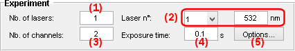
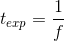

# Experiment settings
{: .no_toc }

Experiment settings is the second panel of module Video processing.

Use this panel to inform MASH-FRET about your experiment setup and to set project options.

## Panel components
{: .no_toc .text-delta }

1. TOC
{:toc}

---

## Number of alternated lasers

It is the number of alternated lasers with different wavelengths used in the experiment. 

For continuous-wavelength excitation, e.g. for videos simulated in MASH, it is set to 1.

**<u>default</u>:** 1

---

## Laser wavelengths

They are the relevant wavelengths in nanometers of each alternated laser. 

Laser wavelengths are used to label data and identify which channel is directly excited by the laser; see 
[Video channels](../functionalities/set-project-options.html#video-channels) for more details.

To set the wavelength, select the laser index in **(a)** and set the wavelength in **(b)**. 
Laser indexes correspond to the order of appearance in the video and can easily be identified by navigating through the first frames of the video; see 
[Navigation](area-visualization.html#navigation) for more information.

**<u>default</u>:** 
* laser 1: 532 nm (wavelengths used to excite Cy3)
* following lasers: previous laser's wavelength increased by 20%

---

## Number of video channels

It is the number of horizontal divisions in the video, each usually corresponding to a detection wavelength range.

Upon modification, channel-dependant parameters and channel limits on video display are automatically updated.

**<u>default</u>:** 2

---

## Exposure time

It is the time spent by the camera to acquire one video frame.

It is noted 
[*t*exp](){: .math_var } and is linked to the video frame rate 
[*f*](){: .math_var } by the relation:

{: .equation }

<!--
{: .equation }
*t*exp = 1 / *f*
-->

with 
[*f*](){: .math_var } in frame per second (fps).

It is automatically updated from the loaded video file. 
If the file does not contain such information, it must be set manually.

**<u>default</u>:** [*t*exp](){: .math_var } = 1 second

---

## Project options

Command that opens settings of the 
[.mash project](../../output-files/mash-mash-project.html) file exported at the end of Video processing workflow; see 
[Workflow](../workflow.html) for more information.

To set the project options, please refer to 
[Set project options](../functionalities/set-project-options.html).

Project options can be modified any time by loading the [.mash project](../../output-files/mash-mash-project.html) file in module Trace processing; see 
[Edit project options](../../trace-processing/panels/area-project-management.html#edit-project-options) for more information.

