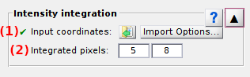

# Intensity integration
{: .no_toc }

Intensity integration is the fifth panel of module Video processing.

Use this panel to create and export single molecule intensity-time traces.

<a href="../../assets/images/gui/VP-panel-integration.png"></a>

## Panel components
{: .no_toc .text-delta }

1. TOC
{:toc}


---

## Input video

Manages the import of single molecule video used to build intensity-time traces.

<a href="../../assets/images/gui/VP-panel-integration-loadvid.png"></a>

The single molecule video is imported from a file by pressing 
.
Supported file formats are described in detail in 
[Load video/image file](visualization-area.html#load-videoimage-file).
The imported file name is then displayed in **(a)**.


---

## Input coordinates

Manages the import of single molecule coordinates used to build intensity-time traces.

<a href="../../assets/images/gui/VP-panel-integration-loadcoord.png"></a>

Single molecule coordinates are imported from an ASCII file by pressing 
.
The imported file name is then displayed in **(a)**.

Coordinates are read from the file following user-defined import settings.
Import settings can be accessed and modified by pressing 
.
In that case the import option window opens:

<a href="../../assets/images/gui/VP-panel-integration-loadcoord-impopt.png"></a>

Single molecule coordinates are coordinates co-localized in each channel, with each channel corresponding to a specific x-range.
The number of file header lines set in **(b)** is skipped before reading coordinates data and channel-specific x- and y-coordinates are read from columns set in **(c)** and **(d)** respectively.
If all channel-specific data are organized in the same two columns, coordinates are sorted according to the specific x-range of each channel.
Import settings are saved only after pressing 
.


---

## Integration parameters

These are the settings used to calculate intensities in intensity-time traces.

<a href="../../assets/images/gui/VP-panel-integration-calculation.png"></a>

To obtain the single molecule intensity at one particular frame or time point, a square area of dimension **(a)** pixels around the molecule coordinates is defined and the **(b)** brightest pixel values in this area are summed up.

Only summed intensities are written to files during export.
However, intensity-time traces can be plotted as average intensity per pixel by checking the box in **(c)**.
In this case, the y-axis of intensity-time trace plots when using the 
[Create trace tool](area-visualization.html#create-trace-tool) is affected.


---

## Create and export intensity-time traces

Command that opens the export options prior starting intensity-time trace calculations. 

To set export options, please refer to 
[Set export options](../functionalities/set-export-options.html).

After saving export options, intensity calculations start for each molecule coordinates present in 
[Input coordinates](#input-coordinates), on each video frame present in 
[Input video](#input-video), with parameters defined in 
[Integration parameters](#integration-parameters), and exports single molecule intensity-time traces to files selected in 
[Export options](#export-options).

This process can be relatively slow if not enough free memory is available on the computer.
In this case the video file is browsed every time a pixel value is needed for calculation. 
For more information, please refer to the respective functions in the source code:

```
MASH-FRET/source/traces/creation/create_trace.m
MASH-FRET/source/traces/creation/getIntTrace.m
```


