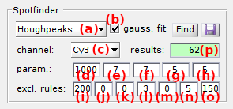

# Molecule coordinates
{: .no_toc }

<a href="../../assets/images/gui/VP-panel-molcoord.png"></a>

## Panel components
{: .no_toc .text-delta }

1. TOC
{:toc}

---

## Average image

Use this tool to load or export an average image of the video.

<a href="../../assets/images/gui/VP-panel-molcoord-aveim.png"></a>

The average image is calculated over a frame range defined by the starting frame index, set in **(a)**, the frame interval, set in **(b)**, and the ending frame index, set in **(c)**.

To start the calculation and export the average image to a 
[_ave.* file](../../output-files/ave-average-image.html), press 
.

Supported file formats are:
* [MASH video format](../../output-files/sira-mash-video.html) (<u>.sira</u>)
* Tagged Image File format (<u>.tif</u>)
* Portable Network Graphics (<u>.png</u>)

To rapidly access the average image folder and load an average image file, press 
.


---

## Spotfinder

Use this tool to find bright spots and export coordinates.

<a href="../../assets/images/gui/VP-panel-molcoord-sf.png"></a>

Spotfinder is limited to the detection of bright spots in video frames and does not include tracking.

To configure the search algorithm, select the detection method in **(a)**.
The four detection methods available are described in detail in the respective sections:
* [in-series screening](#in-series-screening)
* [houghpeaks](#houghpeaks)
* [Schmied2012](#schmied2012)
* [Twotone](#twotone)

As the search algorithm looks for bright spots in individual video channels, method parameters are different for each channel.
To configure the method, select the channel in list **(c)** and set parameters in **(d)**, **(g)** and/or **(h)** according to the method description.
Bright spot intensity profiles can be fitted with 2D-Gaussians to extract shape features by checking the box in **(b)**; see 
[Gaussian fitting](#gaussian-fitting) for more details.

Start spot detection and subsequent Gaussian fitting by pressing 
.
Detected spots are automatically shown on the display with red circles.

The spots are then sorted according to user-defined criteria on the number, position, intensity and shape of spots; see 
[Exclusion rules](#exclusion-rules) for more details.
The number of spots found after applying the exclusion rules is displayed in **(q)**.

The final set of spot coordinates can be exported to a 
[.spots file](../../output-files/spots-spots-coordinates) by pressing 
.


### Gaussian fitting
{: .no_toc }

When Gaussian fitting is activated, a pixel area of **(e)**-by-**(f)** pixels centered on the spot position is fitted with a tilted ellipsoid Gaussian function:

{: .bg-grey-lt-000 .pt-3 .pb-3 .pl-3 .pr-3 .fs-3}
<p style="border-radius: 5px;">
<i>I</i>(<i>x</i>,<i>y</i>) = <i>offset</i> + <i>I</i><sub>0</sub>exp{ - [ <i>a</i>(<i>x</i> - <i>x</i><sub>0</sub>)<sup>2</sup> + 2<i>b</i>(<i>x</i> - <i>x</i><sub>0</sub>)(<i>y</i> - <i>y</i><sub>0</sub>) + <i>c</i>(<i>y</i> - <i>y</i><sub>0</sub>)<sup>2</sup> ] }
</p>

with *offset* the Gaussian offset, *I*<sub>0</sub> the Gaussian amplitude, *x*<sub>0</sub> and *y*<sub>0</sub> the x- and y- spot coordinates, and with coefficient *a*, *b* and *c* containing information about Gaussian width and orientation:

{: .bg-grey-lt-000 .pt-3 .pb-3 .pl-3 .pr-3 .fs-3}
<p style="border-radius: 5px;">
<i>a</i> = cos<sup>2</sup>( <i>&#952;</i> ) / ( 2<i>&#963;</i><sub>x</sub><sup>2</sup> ) + sin<sup>2</sup>( <i>&#952;</i> ) / ( 2<i>&#963;</i><sub>y</sub><sup>2</sup> )<br><br>
<i>b</i> = - sin( 2<i>&#952;</i> ) / ( 4<i>&#963;</i><sub>x</sub><sup>2</sup> ) + sin( 2<i>&#952;</i> ) / ( 4<i>&#963;</i><sub>y</sub><sup>2</sup> )<br><br>
<i>c</i> = sin<sup>2</sup>( <i>&#952;</i> ) / (2<i>&#963;</i><sub>x</sub><sup>2</sup>) + cos<sup>2</sup>( <i>&#952;</i> ) / (2<i>&#963;</i><sub>y</sub><sup>2</sup>)
</p>

with *&#963;*<sub>x</sub> and *&#963;*<sub>y</sub> the Gaussian standard deviations in the x- and y- direction, and <i>&#952;</i> the Gaussian orientation angle.


### Exclusion rules
{: .no_toc }

Exclusion rules are set in **(j-p)** and are described in details in the table below.

| field   | description                                                                                                                                                                                                                                               | default |
| :-----: | --------------------------------------------------------------------------------------------------------------------------------------------------------------------------------------------------------------------------------------------------------- | :-----: |
| **(j)** | Maximum number of spots allowed. The brightest spots a preserved.                                                                                                                                                                                         | 200     |
| **(k)** | Minimum spot intensity allowed. Without Gaussian fitting, Intensities are single pixel values. With Gaussian fitting, intensities are the sums of pixel values in the fitting area reduced by the Gaussian offset.                                        | 0 ic    |
| **(l)** | Minimum distance allowed between spots (in pixel).                                                                                                                                                                                                        | 0 px    |
| **(m)** | Minimum distance allowed between spots and image edges (in pixel).                                                                                                                                                                                        | 3 px    |
| **(n)** | *(only with Gaussian fitting)* Minimum Gaussian standard deviation allowed (in pixel).                                                                                                                                                                    | 0 px    |
| **(o)** | *(only with Gaussian fitting)* Maximum Gaussian standard deviation allowed (in pixel).                                                                                                                                                                    | 5 px    |
| **(p)** | *(only with Gaussian fitting)* Maximum Gaussian asymmetry allowed (in percent). The minimum value is 100% for a perfectly spherical Gaussian. An asymmetry of 200% represents a Gaussian twice larger in the x- (or y-) than in the y- (or x-) direction. | 150%    |


### in series-screening
{: .no_toc }

It is a home-made algorithm adapted from 
[houghpeaks](#houghpeaks) but faster. It processes as described below:

1. it searches for the brightest pixel in the image considering a minimum pixel intensity set in **(d)** 
1. an area of **(g)**-by-**(h)** pixels centered on the brightest pixel is set to zero
1. the algorithm repeats steps 1 and 2 until no pixel with intensity higher than **(d)** are found.


### houghpeaks
{: .no_toc }

It is a built-in function of MATLAB and is described in details in 
[MATLAB's documentation](https://fr.mathworks.com/help/images/ref/houghpeaks.html).

The houghpeaks method uses the same principle and parameters as 
[in-serie screening](#in-series-screening) but works slower.


### Schmied2012
{: .no_toc }

It is an algorithm originally designed for super-resolution microscopy and published in the scientific article: 

J.J. Schmied, A. Gietl, P. Holzmeister, C. Forthmann, C. Steinhauer, T. Dammeyer, P. Tinnefeld, *Fluorescence and super-resolution standards based on DNA origami*, *Nature Methods* **2012**, DOI: 
[10.1038/nmeth.2254](https://doi.org/10.1038/nmeth.2254).

It identifies bright spots considering:
* a minimum ratio spot intensity over background set in **(d)** 
* a minimum distance to the image edge set in **(h)**.

The Schmied2012 algorithm was written in C and was compiled to .mex file via the `mex` function of MATLAB. 
The .mex file may work with certain MATLAB versions and lead to errors with others. 
If the use of Schmied2012 gives an error, please recompile the .mex file by typing in MATLAB's command window:

```matlab
mex 'xxxxx\MASH-FRET\source\extern\schmied2012\forloop.c'
```

with `xxxxx` the path on your computer to the MASH-FRET folder.

If the error persists, please inform us via the  
[issue tracker](https://github.com/RNA-FRETools/MASH-FRET/issues) on Github.


### Twotone
{: .no_toc }

It is an algorithm originally designed to localize single molecules in TIRF-FRET videos and is used in the software Twotone:

A.N. Kapanidis, N.K. Lee, T.A. Laurence, S. Doose, E.Margeat, S. Weiss, *Defining the Limits of Single-Molecule FRET Resolution in TIRF Microscopy*, *Proc. Nat. Acad. Sci.* **2004**, DOI: 
[10.1016/j.bpj.2010.09.005](https://doi.org/10.1016/j.bpj.2010.09.005)

It processes as described below:
1. apply the Twotone image filter to the average image or video frame with a kernel size set in **(d)**; see 
   [Filters](panel-edit-video.html#filters) for more information
1. search in the filtered image for pixels brighter than the intensity threshold set in **(g)**
1. only the pixels that are local maxima in the 3-by-3 pixel area around them are detected as spots.

---

## Coordinates transformation

Use this tool to transform spots coordinates into other video channels and obtain single molecule coordinates.

<a href="../../assets/images/gui/VP-panel-molcoord-transf.png"></a>

Spots coordinates are translated in other channels after applying a group of specific symmetry operations, called the spatial transformation.
Transformed coordinates are called single molecule coordinates and are exported to a 
[.coord file](../../output-files/coord-transformed-coordinates) by pressing 
.
Before transforming spots coordinates, make sure the spots coordinates and the spatial transformation are imported as described below.

Spots coordinates written in ASCII files can be imported in **(d)**:
* either automatically, after saving spots coordinates with Spotfinder; see 
[Spotfinder](#spotfinder) for more information
* or by pressing 
 and selecting the previously exported spots coordinates file; coordinates are imported according to the 
[Import options](#import-options).

The spatial transformation stored in a 
[.mat file](../../output-files/mat-transformation.html) can be imported in **(c)**:
* either automatically, after calculation from a set of reference coordinates, according to the transformation type selected in **(b)**, and by pressing 
; see 
[Transformation types](#transformation-types) for more details about the available types
* or by pressing 
 and selecting the previously exported transformation 
[.mat file](../../output-files/mat-transformation.html).

Reference coordinates are already-transformed coordinates written in ASCII files that can be imported in **(a)**:
* either automatically after mapping coordinates on a reference image with the mapping tool that can be accessed by pressing 
; see 
[Use the mapping tool](../functionalities/use-the-mapping-tool.html) to use the mapping tool
* or by pressing 
 and selecting the previously exported reference coordinates file; coordinates are imported according to the 
[Import options](#import-options).

Before transforming any set of coordinates, it is recommended to test the validity of the transformation on a benchmark image (usually the average image of a single bead video recorded parallel to the experiment).
This is done by overlaying the original benchmark image (colored in red) with the transformed one (colored in green).
Perfect transformation will result in a perfect overlay of images and thus, in a yellow image.
When the original and transformed images are shifted, a new transformation needs to be calculated from a new set of reference coordinates.


Transformation quality can be checked by pressing 
 and selecting the benchmark image file.


### Transformation types
{: .no_toc }

Transformation types are groups of symmetry operations.
All transformation types are given in MATLAB and are explained in details in 
[MATLAB's documentation](https://fr.mathworks.com/help/images/ref/cp2tform.html#f1-283651-transformtype) or in the table below.
Each type necessitates a minimum number of reference coordinates, which is indicated in the last column.

| type                        | symmetry operations                                                                                                    | min. ref |
| :-------------------------: | ---------------------------------------------------------------------------------------------------------------------- | :------: |
| `Non reflective similarity` | translation, rotation, uniform scaling                                                                                 | 2        |
| `Similarity`                | translation, rotation, uniform scaling, reflection                                                                     | 3        |
| `Affine`                    | translation, rotation, uniform scaling, reflection, uniaxial linear distortion                                         | 3        |
| `Projective`                | translation, rotation, uniform scaling, reflection, biaxial linear distortion                                          | 4        |
| `Plynomial ord2`            | translation, rotation, uniform scaling, reflection, curvilinear distortion by applying a 2nd order polynomial function | 6        |
| `Plynomial ord3`            | translation, rotation, uniform scaling, reflection, curvilinear distortion by applying a 3rd order polynomial function | 10       |
| `Plynomial ord4`            | translation, rotation, uniform scaling, reflection, curvilinear distortion by applying a 4th order polynomial function | 15       |
| `Piecewise linear`          | scaling specific to different parts of the image                                                                       | 4        |
| `Local mean weight`         | locally specific scaling                                                                                               | 12       |


### Import options
{: .no_toc }

They are the settings to import reference and spots coordinates from ASCII files.
Import options can be accessed by pressing 
.

To set the import options, please refer to 
[Set coordinates import options](../functionalities/set-coordinates-import-options.html).

