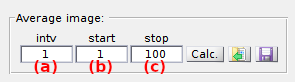

# Molecule coordinates
{: .no_toc }

## Panel components
{: .no_toc .text-delta }

1. TOC
{:toc}

---

## Average image

---

## Spotfinder

### Spotfinder settings
{: .no_toc }

### Exclusion rules
{: .no_toc }

---

## Coordinates transformation

### Reference coordinates
{: .no_toc }

### Transformation type
{: .no_toc }

### Import options
{: .no_toc }

Command that opens settings to import reference and spots coordinates from ASCII files.

To set the import options, please refer to 
[Set coordinates import options](../functionalities/set-coordinates-import-options.html).

