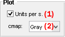
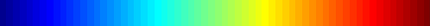
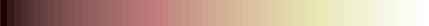

# Plot
{: .no_toc }

Plot is the first panel module Video processing.

Use this panel to set the appearance and units in the 
[Visualization area](area-visualization.html).

## Panel components
{: .no_toc .text-delta }

1. TOC
{:toc}

---

## Pixel intensity units

Pixel intensities are expressed in (image) counts and can be given in counts per second by checking the **Units per s.** box.

Intensity units are used for 
[Video visualization](area-visualization.html#video-visualization), in the 
[Create trace tool](area-visualization.html#create-trace-tool) and in
[.spots files](../..//output-files/spots-spots-coordinates.html).

**<u>default</u>:** intensities are given in count per second.

---

## Color map

It is the color palette used to display pixel intensities.

It can be changed by selecting a new color map in the list. 
The list offers the standard color maps in MATLAB:

| name     | palette                                                           |
| :------: | :---------------------------------------------------------------: |
| `Jet`    |     |
| `Gray`   |    |
| `Hot`    |     |
| `Cool`   |    |
| `Spring` |  |
| `Summer` |  |
| `Autumn` |  |
| `Winter` |  |
| `Pink`   |    |
| `Bone`   |    |
| `Copper` |  |

**<u>default</u>:** `Jet`

