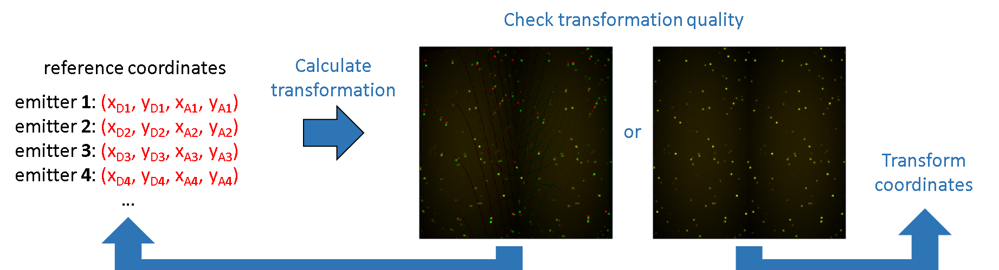

# Workflow
{: .no_toc }

In this section you will learn how to process single molecule videos to obtain single molecule coordinates and intensity-time traces. Exported data are further used in modules 
[Trace processing](../trace-processing.html) and 
[Histogram analysis](../histogram-analysis) for 
[data analysis](../tutorials/analyze-data.html).

The procedure includes four steps:

1. TOC
{:toc}

---

## Create a video-based project

The first step in processing a single molecule video is to create a new video-based project. 
This implies to import the video file and register the associated experiment settings. 
Informing MASH about the particular experiment settings is crucial to adapt the software functionalities to your own experiment setup.

After the project creation is completed, it is recommended to save it to a 
[.mash file](../output-files/mash-mash-project.html) that should regularly be overwritten as the analysis progresses.

In theory, the software is compatible with:

* an unlimited number of video channels,
* an unlimited number of alternated lasers,
* FRET calculations for an unlimited number of FRET pairs.

To create a new video-based project:

{: .procedure }
1. Open the experiment settings window by pressing 
    in the 
   [project management area](../Getting_started#project-management-area) and selecting `import video`.  
     
1. Import a multi-channel video file or multiple single-channel video files and define your experiment setup by configuring tabs:  
     
   [Import](../tutorials/set-experiment-settings/import-video.html#import)  
   [Channels](../tutorials/set-experiment-settings/import-video.html#channels)  
   [Lasers](../tutorials/set-experiment-settings/import-video.html#lasers)  
   [Calculations](../tutorials/set-experiment-settings/import-video.html#calculations)  
   [Divers](../tutorials/set-experiment-settings/import-video.html#divers)  
     
   If necessary, modify settings in 
   [Calculations](../tutorials/set-experiment-settings/import-video.html#calculations) and 
   [Divers](../tutorials/set-experiment-settings/import-video.html#divers) any time after project creation.  

     
1. Finalize the creation of your project by pressing 
   ; the experiment settings window now closes and the interface switches to module Video processing.  
     
1. Save modifications to a 
   [.mash file](../output-files/mash-mash-project.html) by pressing 
    in the 
   [project management area](../Getting_started#project-management-area).

---

## Localize bright spots

Bright spots coordinates are different from single molecule coordinates to the extent that molecule coordinates are paired across all video channels and spots coordinates concern individual channels. 
Spot detection in single molecule videos (SMV) is often made more complicated by the presence of competitive background noise and by the variation of single molecule brightness in time.

To get rid of brightness variations in time and smooth the background noise, video frames are averaged into one average image.

To increase the contrast between bright spots and background, and thus ease spot detection, the average image can be treated with image filters. 
MASH offers a set of basic or smFRET-specific image filters that can be used for such purpose. 
Some image filters can also be used as background correction on the video prior creating intensity-time traces; see 
[Remarks](#remarks) for more details.

Finally, spot detection is performed on the filtered average image with the Spotfinder tool.

To localize bright spots in the SMV:

{: .procedure }
1. If necessary, set parameters in 
   [Filter settings](components/panel-edit-video.html#filter-settings) and apply the image filter by pressing 
   . Filters can be cumulated and are managed in the 
   [Filter list](components/panel-edit-video.html#filter-list).  
     
1. If necessary, calculate an average image alternative to standards, *i.e.*, on the full video frame range, by setting parameters in 
   [Average image](components/panel-molecule-coordinates.html#average-image) and pressing 
   .  
     
1. Detect bright spots by configuring the 
   [Spotfinder](components/panel-molecule-coordinates.html#spotfinder) tool for each channel and pressing 
   .

---

## Transform spots coordinates

To obtain single molecules coordinates, spots coordinates must be transformed into other channels. 
This implies the calculation of a spatial transformation specific to your setup.

The transformation from one channel to another uses a combination of symmetry operations which is specific to the recording setup. 
It is calculated from an already co-localized set of coordinates called the reference coordinates. 
These coordinates are mapped manually using a reference image where reference samples emits in all channels.

The quality of the mapping, and thus the transformation, is judged by eye from the superposition of the original and transformed reference images. 
In the case of a 2-channel experiment, the original image is colored in red and the transformed image in green. 
If the transformation is correct, reference emitters will appear as yellow dots on a dark background. 
If the quality is poor, red and green dots will be visible and the operation must be repeated with a more thorough mapping in terms of position accuracy, image coverage or number of mapped positions.

To calculate and export the spatial transformation:

{: .procedure }
1. Load the reference image and open the 
   [mapping tool](functionalities/use-mapping-tool.html) by pressing 
   .  
     
1. Map positions in every channels with the 
   [mapping tool](functionalities/use-mapping-tool.html) and save the mapping by closing the tool.  
     
1. Calculate the transformation by pressing 
   .  
     
1. Load the reference image by pressing 
    and judge the transformation quality; 
   if the quality is not satisfying, return to step 2 by increasing the number of mapped position or homogenizing the image coverage.  
     
1. Export the transformation to a 
   [.mat file](../output-files/mat-transformation.html) for use in future projects by pressing 
   ; this will allow you to skip steps 1-4 next time.  
     
1. Recalculate and export the transformation whenever the setup is realigned. 

To transform spots coordinates:

{: .procedure }
1. Transform the spots coordinates by pressing 
   .

---

## Create intensity-time traces

Intensities are calculated by summing up the brightest pixels in a square area around the molecule coordinates.
The operation is repeated on every video frame to build the single molecule intensity-time traces.

After intensity integration is completed, intensity trajectories become immediately available for 
[Trace processing](../trace-processing.html) and 
[Histogram analysis](../histogram-analysis.html).

To calculate intensity-time traces:

{: .procedure }
1. Set parameters in [Integration parameters](components/panel-intensity-integration.html#integration-parameters)  
     
1. Press 
    to calculate intensity-time traces and refresh data in modules 
   [Trace processing](../trace-processing.html) and 
   [Histogram analysis](../histogram-analysis.html); see 
   [Remarks](#remarks) for more details.

---

## Remarks
{: .no_toc}

Even though background correction is more accurate when performed in module Trace processing, some image filters can be used as background correction in Video processing; see 
[Filters](components/panel-edit-video.html#filters) for more information.
To do so, the background-corrected video must be exported to a file and the current project abadonned. 
A new video-based project must be created using the new video file in order to generate background-corrected intensity-time traces. 
In this specific case, background correction must be deactivated later in module Trace processing; see
[Background correction](../trace-processing/components/panel-subimage-background-correction.html#background-correction) for more information.

Creating intensity-time traces can be a slow process if not enough free RAM is available; see 
[Calculate intensity-time traces](components/panel-intensity-integration.html#calculate-intensity-time-traces) for more information.

